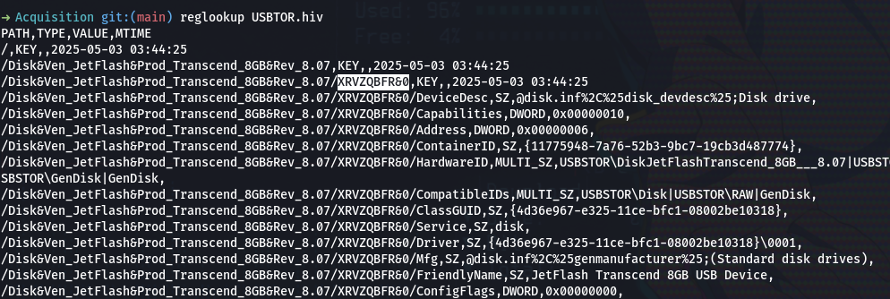

# USB Forensic 5
## soal
ada hacker, physical acces ke laptop.. bantuin dong ! \
(Filenya ada di pertanyaan pertama) \
Apa Serial ID USB Yang dipakai Hacker ? \
format flag : IDN_FLAG{Jawaban yang disoal}

## solve
- Pada tantangan ini, kita diminta untuk mencari Serial ID dari perangkat USB.
- Awalnya, saya mencoba mencarinya menggunakan perintah: ```reglookup USBTOR.hiv | grep Serial```
- Namun, tidak menemukan hasil yang relevan.
- Setelah menelusuri lebih lanjut isi dari file registry USBTOR.hiv, saya melihat adanya string yang muncul sebelum bagian Properties, yaitu: ```XRVZQBFR&0```
  
- Saya menduga bahwa string tersebut merupakan Serial ID yang dimaksud. Setelah saya coba memasukkan flag dengan format: **IDN_FLAG{XRVZQBFR&0}**

## flag
IDN_FLAG{XRVZQBFR&0}