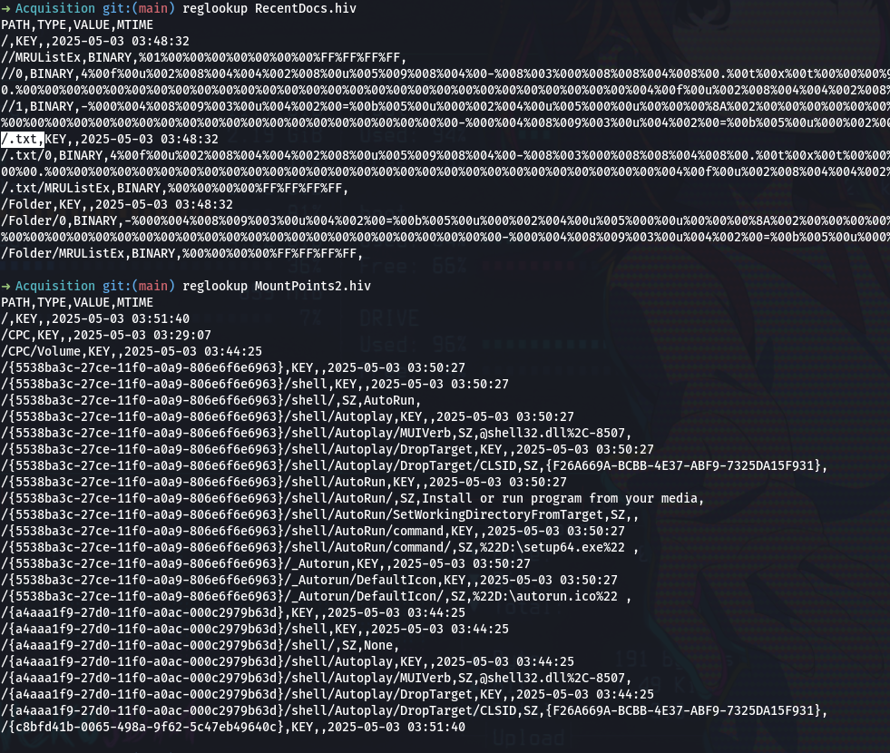
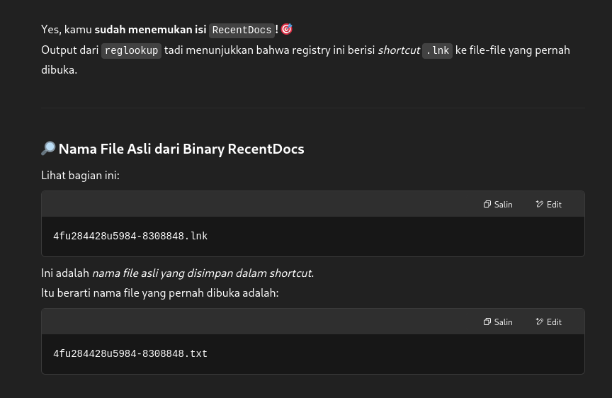

# USB Forensic 6
## soal
ada hacker, physical acces ke laptop.. bantuin dong ! \
(Filenya ada di pertanyaan pertama) \
Nama File Yang ada di USB ? \
format flag : IDN_FLAG{Jawaban yang disoal}

## solve
- Pada tantangan ini, kita diminta untuk mencari nama file yang ada di USB milik hacker.
- Awalnya, saya mencoba mencarinya di file registry USBTOR.hiv, namun tidak berhasil menemukan informasi yang relevan.
- Kemudian, saya melanjutkan pencarian di file registry lainnya. Saya menemukan ekstensi file .txt, tetapi nama filenya muncul dalam bentuk binary atau tidak terbaca secara langsung.
- Untuk mencoba pendekatan lain, saya menggunakan tool RegRipper dengan perintah berikut: ```regripper -r RecentDocs.hiv -f ntuser``` dan ```regripper -r NTUSER.DAT -f ntuser```
  
- Namun, hasilnya masih belum menunjukkan nama file yang bisa digunakan.
- saya menemukan extension **.txt**, hanya saja nama filenya dalam bentuk binary.
- jadi saya mencoba cara lain dengan menggunakan tool regripper seperti
  ```bash
  regripper -r RecentDocs.hiv -f ntuser
  regripper -r NTUSER.DAT -f ntuser
  ``` 
- Akhirnya, saya meminta bantuan ChatGPT dan berhasil menemukan nama file dalam format yang valid. Setelah saya input sebagai flag: ```IDN_FLAG{4fu284428u5984-8308848.txt}```
  

## flag
IDN_FLAG{4fu284428u5984-8308848.txt}