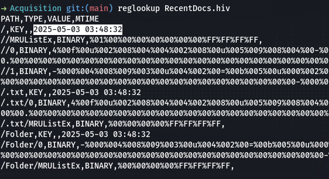

# USB Forensic 8
## soal
ada hacker, physical acces ke laptop.. bantuin dong ! \
(Filenya ada di pertanyaan pertama) \
File dibuka pada jam ? \
format flag : IDN_FLAG{Jawaban yang disoal} example : xxxx-xx-xx xx:xx:xx

## solve
- Pada tantangan ini, kita diminta untuk mencari tanggal file dibuka oleh hacker.
- Karena sebelumnya saya sudah berhasil menemukan nama file yang dicari, saya memeriksa file registry RecentDocs.hiv, dan di sana terdapat informasi timestamp terkait file tersebut.
- Saya menemukan tanggal akses file sebagai berikut: ```2025-05-03 03:48:32```
  
- Setelah itu, saya memasukkan flag dengan format: **IDN_FLAG{2025-05-03 03:48:32}**

## solve
IDN_FLAG{2025-05-03 03:48:32}