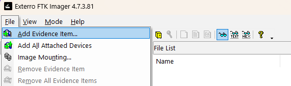
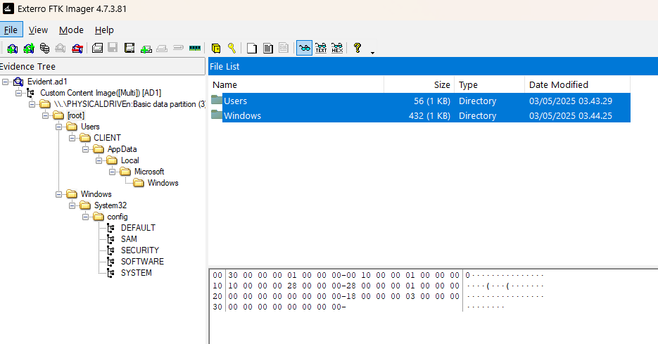
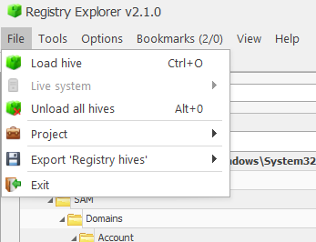

## Setup FTK Images, dan Registery Explorer
- [ftk-imager-4-7-3-81](https://www.exterro.com/ftk-product-downloads/ftk-imager-4-7-3-81)
- [NET](https://dotnet.microsoft.com/id-id/download)
- [Registry Explore by ericzimmerman](https://ericzimmerman.github.io/#!index.md)

## setup
- add evidence item
  
- pilih file dan folder yang ingin di export
  
- export file dan folder nya ket tempat yang di inginkan
  
- setelah itu tutup, dan buka file registry explore, pilih load file
  
- setelah itu tinggal load file yang diinginkan

```
tree /f
Folder PATH listing for volume DUALBOOT
Volume serial number is B885-9B12
E:.
└───windows
    └───Accqution
        │   Evident.ad1.txt
        │   Evident.ad1
        │
        ├───Users
        │   └───CLIENT
        │           NTUSER.DAT.FileSlack
        │
        └───Windows
            └───System32
                └───config
                        SOFTWARE
                        SOFTWARE.FileSlack
                        SYSTEM
                        SYSTEM.FileSlack
                        DEFAULT
                        DEFAULT.FileSlack
                        SECURITY
                        SAM
                        SAM.FileSlack
```