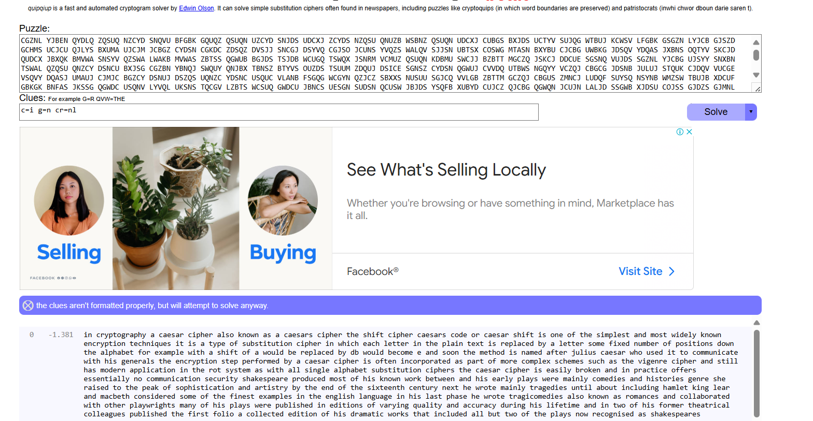
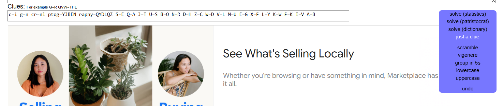



# soal
Well done. You’ve moved past an easy substitution cipher. \
The main weakness of a simple substitution cipher is repeated use of a simple key. In the previous exercise you were able to introduce arbitrary plaintext to expose the key. In this example, the cipher mechanism is not available to you, the attacker.

However, you have been lucky. You have intercepted more than one message. The password to the next level is found in the file ‘krypton4’. You have also found 3 other files. (found1, found2, found3)

You know the following important details: \
The message plaintexts are in American English (*** very important) - They were produced from the same key (*** even better!)
Enjoy.

# ssh
```bash
sshpass -p "CAESARISEASY" ssh -o StrictHostKeyChecking=no krypton3@krypton.labs.overthewire.org -p 2231

# scp
sshpass -p "CAESARISEASY" scp -R -P 2231 krypton3@krypton.labs.overthewire.org:/krypton/krypton3/* krypton3
```

# solve
```bash
cd /krypton/krypton3
ls
# found1  found2  found3  HINT1  HINT2  krypton4  README

cat HINT1
# Some letters are more prevalent in English than others.

cat HINT2
# "Frequency Analysis" is your friend.

cat krypton4 
# KSVVW BGSJD SVSIS VXBMN YQUUK BNWCU ANMJS
```

jika terdapat kata kata frequency analysis bisa jadi iniadalah subsitusi cipher \
terdapat beberapa tool untuk subsitusi cipher salah satunya yaitu \
sebelum kita mencoba mencari tau pola krypton4 kita perlu mencari pola dengan beberapa teks pada found1 - found3 karena semakin banyak teks nya semakin mudah untuk mendapatkan pola

## solve with tool
- [https://www.quipqiup.com/](https://www.quipqiup.com/)
  

- found 1
  ```
  in cryptography a caesar cipher also known as a caesars cipher the shift cipher caesars code or caesar shift is one of the simplest and most widely known encryption techniques it is a type of substitution cipher in which each letter in the plain text is replaced by a letter some fixed number of positions down the alphabet for example with a shift of a would be replaced by db would become e and soon the method is named after julius caesar who used it to communicate with his generals the encryption step performed by a caesar cipher is often incorporated as part of more complex schemes such as the vigenre cipher and still has modern application in the rot system as with all single alphabet substitution ciphers the caesar cipher is easily broken and in practice offers essentially no communication security shakespeare produced most of his known work between and his early plays were mainly comedies and histories genre she raised to the peak of sophistication and artistry by the end of the sixteenth century next he wrote mainly tragedies until about including hamlet king lear and macbeth considered some of the finest examples in the english language in his last phase he wrote tragicomedies also known as romances and collaborated with other playwrights many of his plays were published in editions of varying quality and accuracy during his lifetime and in two of his former theatrical colleagues published the first folio a collected edition of his dramatic works that included all but two of the plays now recognised as shakespeares
  ```
- after that u need for add clue
  
  - ex: c=i g=n cr=nl
- after i try again with 3 file and i got the clue:
  ```bash
  c=i g=n cr=nl ptog=YJBEN raphy=QYDLQZ S=E Q=A J=T U=S B=O N=R D=H Z=C W=D V=L M=U E=G X=F L=Y K=W F=K I=V A=B
  ```
  
- and i change the cipher for teks krytpon4
  ```bash
  KSVVW BGSJD SVSIS VXBMN YQUUK BNWCU ANMJS

  ##
  well done the level cour password is brute # yang mendekati ini
  well done g he level cour password is kruge
  hell ton edge level cour was short is prude
  ```
- namun ketika aku coba ini tidak berhasil mungkin jika menggunakan tool tidak terlalu efektif
- namun jika dilihat lihat cipher textnya itu adalah huruf besar jadi saya mencoba untuk mengubah menjadi huruf besar semua **BRUTE** dan berhasil login
  ```
  WELL DONE THE LEVEL FOUR PASSWORD IS BRUTE
  ```

## solve with manual (cli) (belum berhasil)
```bash
git clone https://github.com/m-rosinsky/Krypton_Scripts
cp Krypton_Scripts/freq_analysis.py .

python3 freq_analysis.py found1 1
# S:      155
# C:      107
# Q:      106

python3 freq_analysis.py found1 3
# JDS:    19
# DSN:    11
# QGW:    11
```

```bash
for i in {A..Z}; do cat found1 found2 found3 | tr -cd $i | wc -c | tr -d '\n'; printf " $i\n" ; done | sort -nr
# 456 S
# 340 Q
# 301 J
# 257 U
# 246 B
# 240 N
# 227 G
# 227 C
# 210 D
# 132 Z
# 130 V
# 129 W
# 86 M
# 84 Y
# 75 T
# 71 X
# 67 K
# 64 E
# 60 L
# 55 A
# 28 F
# 19 I
# 12 O
# 4 R
# 4 H
# 2 P

# Freq list: ETAOINSRHDLUCMFYWGPBVKXQJZ
# Cipher text: SQJUBNGCDZVWMYTXKELAFIORHP
```

- langkah
```bash
cat krypton4
# KSVVW BGS JDS VSIS VXBMN YQUUK BNWCU ANMJS

cat krypton4 | tr ["JDS"] ["the"] # because freq 3 let ke 1
# KeVVW BGeth eVeIe VXBMN YQUUK BNWCU ANMte

cat krypton4 | tr ["JDSQB"] ["theao"] # karena Q freq 1 let ke 2, B karena dia juga aioeo (fokus ke aiueo dulu)
# KeVVW oGeth eVeIe VXoMN YaUUK oNWCU ANMte

cat krypton4 | tr ["JDSQBKVI"] ["theaowlv"]
# wellW oGeth eleve lXoMN YaUUw oNWCU ANMte

cat krypton4 | tr ["JDSQBKVIWG"] ["theaowlvdes"]


KeVVW BGe the VeIe VXBMN YQUUK BNWCU ANMte
KeVVW oGe the leIe lXoMN YaUUK oNWAU ANMte

cat krypton4 | tr ["JDSQB"] ["theao"]

KeVVW oGe the leIe lXoMN YaUUK oNWAU ANMte
well WoGe the level XoMN YaUUK oNWAU ANMte

tr ["JDSQBKVI"] ["THEAOWLV"]

well WoGe the level XoMN YaUUK oNWAU ANMte
well done the level XoMN YaUUW oNWAU ANMte

tr ["JDSQBKVIWG"] ["THEAOWLVDN"]

well done the level XoMr passK oNWAU ANMte


tr ["JDSQBKVIWEUYR"] ["THEAOWLVDESPR"]

well done the level XoMr passK oNWAU ANMte
well done the level four password AUANMte

tr ["JDSQBKVIWEUYRXMK"] ["THEAOWLVDESPRFUW"]

OGETH ELEVE LFOUN PASSW ONDCS ANUTE
```

- https://www3.nd.edu/~busiforc/handouts/cryptography/cryptography%20hints.html
```bash
E T A O I N S H R D L U
```

# manual (gagal)
```bash
for i in {A..Z}; do printf $i; done
# ABCDEFGHIJKLMNOPQRSTUVWXYZ

for i in {A..Z}; do printf $i; cat found1 found2 found3; done
ACGZNL YJBEN QYDLQ ZQSUQ NZCYD SNQVU BFGBK GQUQZ QSUQN UZCYD SNJDS UDCXJ ZCYDS NZQSU QNUZB WSBNZ QSUQN UDCXJ CUBGS BXJDS UCTYV SUJQG WTBUJ KCWSV LFGBK GSGZN LYJCB GJSZD GCHMS UCJCU QJLYS BXUMA UJCJM JCBGZ CYDSN CGKDC ZDSQZ DVSJJ SNCGJ DSYVQ CGJSO JCUNS YVQZS WALQV SJJSN UBTSX COSWG MTASN BXYBU CJCBG UWBKG JDSQV YDQAS JXBNS OQTYV SKCJD QUDCX JBXQK BMVWA SNSYV QZSWA LWAKB MVWAS ZBTSS QGWUB BGJDS TSJDB WCUGQ TSWQX JSNRM VCMUZ QSUQN KDBMU SWCJJ BZBTT MGCZQ JSKCJ DDCUE SGSNQ VUJDS SGZNL YJCBG UJSYY SNXBN TSWAL QZQSU QNZCY DSNCU BXJSG CGZBN YBNQJ SWQUY QNJBX TBNSZ BTYVS OUZDS TSUU ....

for i in {A..Z}; do printf $i; cat found1 found2 found3 | tr -cd $i; done
#AAAAAAAAAAAAAAAAAAAAAAAAAAAAAAAAAAAAAAAAAAAAAAAAAAAAAAAABBBBBBBBBBBBBBBBBBBBBBBBBBBBBBBBBBBBBBBBBBBBBBBBBBBBBBBBBBBBBBBBBBBBBBBBBBBBBBBBBBBBBBBBBBBBBBBBBBBBBBBBBBBBBBBBBBBBBBBBBBBBBBBBBBBBBBBBBBBBBBBBBBBBBBBBBBBBBBBBBBBBBBBBBBBBBBBBBBBBBBBBBBBBBBBBBBBBBBBBBBBBBBBBBBBBBBBBBBBBBBBBBBBBBBBBBBBBBBBBBBBBBBBCCCCCCCCC

for i in {A..Z}; do printf $i; cat found1 found2 found3 | tr -cd $i| wc -c; done
A55 # A 55
B246 # B 246
---

for i in {A..Z}; do printf $i; cat found1 found2 found3 | tr -cd $i| wc -c | tr -d "\n"; done
# A55B246C227D210E64F28G227H4I19J301K67L60M86N240O12P2Q340R4S456T75U257V130W129X71Y84Z132

## remove first variable $i and add in the last
for i in {A..Z}; do cat found1 found2 found3 | tr -cd $i | wc -c | tr -d "\n"; printf " $i \n"; done | sort -nr
456 S
340 Q
301 J
257 U
246 B
240 N
227 G
227 C
210 D
132 Z
130 V
129 W
86 M
84 Y
75 T
71 X
67 K
64 E
60 L
55 A
28 F
19 I
12 O
4 R
4 H
2 P

- dan karena S adalah kata yang sering muncul
- asumsikan bahwa s adalahh huruf e karena e adalah kata yang sering muncul dalam bahasa inggris
- disini saya mencoba dengan list ini dan berharap teksnya benar
  - https://www3.nd.edu/~busiforc/handouts/cryptography/cryptography%20hints.html
    ```bash
    E T A O I N S H R D L U
    ```

cat krypton4 | tr "SQJUBNGCDZVWMYTXKELAFIORHP" "ETAOINSHRDLU"
```

## bash shell looping (test)
```bash
## iterasi semua output dan menyamakan dengan $i
for i in {a..z}; do echo "aria fatah anom" | tr -cd $i; done # aria fatah anom => aaaaaf...
# aaaaafhimnort

## iterasi dengan taambahan wc c yang digunakan untuk menghitung byte
for i in {a..z}; do printf $i; echo "aria fatah anom" | tr -cd $i | wc -c; done && echo
a5 # a terdapat 5
---
# ketika printf $i maka dia akan juga manampilkan abcde..z dengan tambahan masing masing iterasi

echo "aria_fatah" | tr -d _ # delete _ string
# ariafatah

echo "aria_fatah" | tr -cd aria # compleate delete only show teks a, r, i
# ariaaa
```

# flag
BRUTE