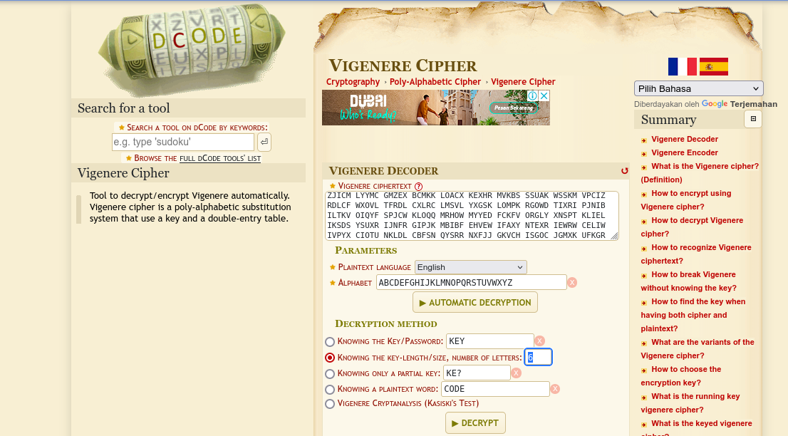
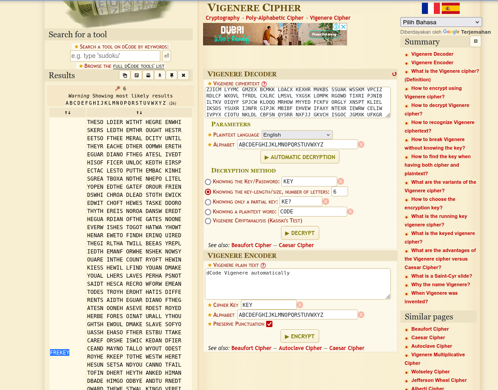
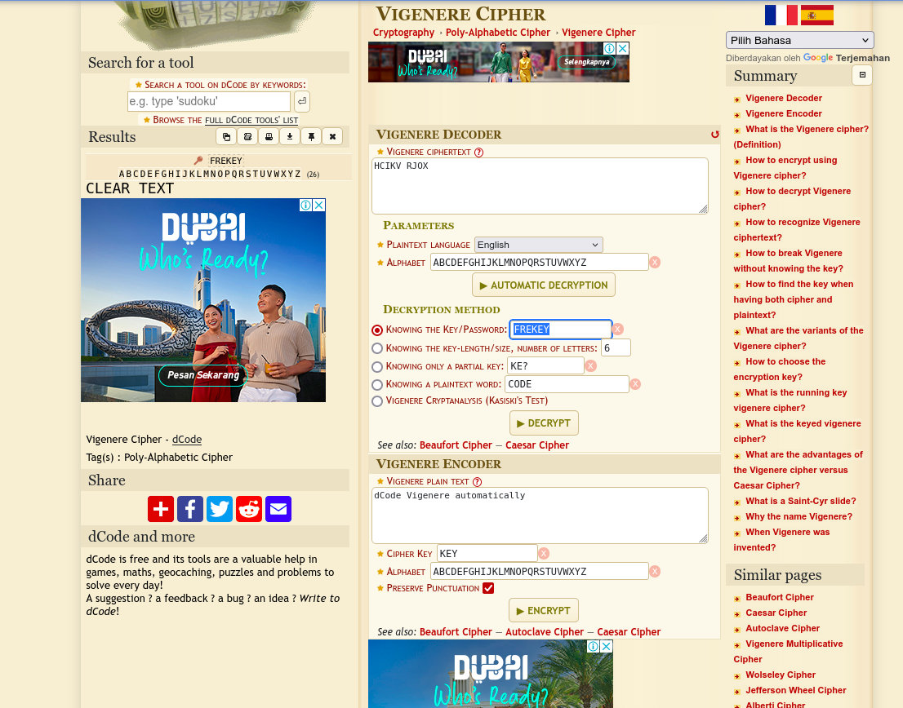



# soal
Good job! \
You more than likely used some form of FA and some common sense to solve that one.

So far we have worked with simple substitution ciphers. They have also been ‘monoalphabetic’, meaning using a fixed key, and giving a one to one mapping of plaintext (P) to ciphertext (C). Another type of substitution cipher is referred to as ‘polyalphabetic’, where one character of P may map to many, or all, possible ciphertext characters.

An example of a polyalphabetic cipher is called a Vigenère Cipher. It works like this:

If we use the key(K) ‘GOLD’, and P = PROCEED MEETING AS AGREED, then “add” P to K, we get C. When adding, if we exceed 25, then we roll to 0 (modulo 26).

P P R O C E E D M E E T I N G A S A G R E E D \
K G O L D G O L D G O L D G O L D G O L D G O

becomes: \
P 15 17 14 2 4 4 3 12 4 4 19 8 13 6 0 18 0 6 17 4 4 3 \
K 6 14 11 3 6 14 11 3 6 14 11 3 6 14 11 3 6 14 11 3 6 14 \
C 21 5 25 5 10 18 14 15 10 18 4 11 19 20 11 21 6 20 2 8 10 17 \

So, we get a ciphertext of: \
VFZFK SOPKS ELTUL VGUCH KR

This level is a Vigenère Cipher. You have intercepted two longer, english language messages (American English). You also have a key piece of information. You know the key length!

For this exercise, the key length is 6. The password to level five is in the usual place, encrypted with the 6 letter key.

Have fun!

# ssh
```bash
sshpass -p "BRUTE" ssh -o StrictHostKeyChecking=no krypton4@krypton.labs.overthewire.org -p 2231

# scp
sshpass -p "BRUTE" scp -R -P 2231 krypton4@krypton.labs.overthewire.org:/krypton/krypton4/* krypton4
```

# solve
```bash
cd /krypton/krypton4
ls
# found1  found2  HINT  krypton5  README

cat HINT 
# Frequency analysis will still work, but you need to analyse it
# by "keylength".  Analysis of cipher text at position 1, 6, 12, etc
# should reveal the 1st letter of the key, in this case.  Treat this as
# 6 different mono-alphabetic ciphers...

# Persistence and some good guesses are the key!

cat README 
# Good job!

# You more than likely used frequency analysis and some common sense
# to solve that one.

# So far we have worked with simple substitution ciphers.  They have
# also been 'monoalphabetic', meaning using a fixed key, and 
# giving a one to one mapping of plaintext (P) to ciphertext (C).
# Another type of substitution cipher is referred to as 'polyalphabetic',
# where one character of P may map to many, or all, possible ciphertext 
# characters.

# An example of a polyalphabetic cipher is called a Vigen�re Cipher.  It works
# like this:

# If we use the key(K)  'GOLD', and P = PROCEED MEETING AS AGREED, then "add"
# P to K, we get C.  When adding, if we exceed 25, then we roll to 0 (modulo 26).


# P     P R O C E   E D M E E   T I N G A   S A G R E   E D
# K     G O L D G   O L D G O   L D G O L   D G O L D   G O

# becomes:

# P     15 17 14 2  4  4  3 12  4 4  19  8 13 6  0  18 0  6 17 4 4   3
# K     6  14 11 3  6 14 11  3  6 14 11  3  6 14 11  3 6 14 11 3 6  14
# C     21 5  25 5 10 18 14 15 10 18  4 11 19 20 11 21 6 20  2 8 10 17

# So, we get a ciphertext of:

# VFZFK SOPKS ELTUL VGUCH KR

# This level is a Vigen�re Cipher.  You have intercepted two longer, english 
# language messages.  You also have a key piece of information.  You know the 
# key length!

# For this exercise, the key length is 6.  The password to level five is in the usual
# place, encrypted with the 6 letter key.

# Have fun!


## penjelasan by me (agak ngawour)
misal ada kalimat seperti ini
P     P R O C E   E D M E E   T I N G A   S A G R E   E D
K     G O L D G   O L D G O   L D G O L   D G O L D   G O

P     15 17 14 2  4  4  3 12  4 4  19  8 13 6  0  18 0  6 17 4 4   3
K     6  14 11 3  6 14 11  3  6 14 11  3  6 14 11  3 6 14 11 3 6  14
C     21 5  25 5 10 18 14 15 10 18  4 11 19 20 11 21 6 20  2 8 10 17

# intinya dia akan melakukan shift sebanyak key nya
# misal plain textnya PROCEEDM, maka jika keynya GOLD maka PROC, EEDM akan dilakukan shift sebanyak keynya 15 17 144 2 di shift dengan 6 14 11 3 menjadi 21 5 25 5
```

## solve with tool
Gunakan situs [dcode.fr Vigenère Cipher](https://www.dcode.fr/vigenere-cipher) untuk mendekripsi teks dalam file found1. \

Masukkan teks sandi dari found1 ke kolom Cipher Text.
1. Pilih **Knowing Key Length** dan masukkan **6**.
2. Tekan **Decrypt**. \

3. Akan muncul beberapa kemungkinan kunci, salah satunya **FREEKEY**. \


Setelah menemukan kunci, gunakan kembali situs yang sama untuk mendekripsi isi krypton5:
1. Masukkan teks dari **krypton5** ke kolom **Cipher Text**.
2. Pilih Knowing the Key dan masukkan **FREEKEY**.
3. Tekan **Decrypt**.
4. Hasilnya adalah **CLEAR TEXT** yang merupakan password untuk level berikutnya. \


## solve with cli
- blm dibuat karena susah

# flag
CLEARTEXT