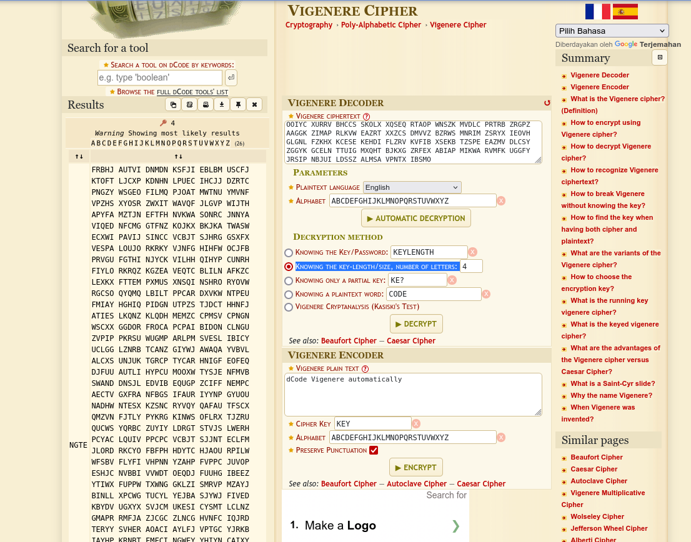
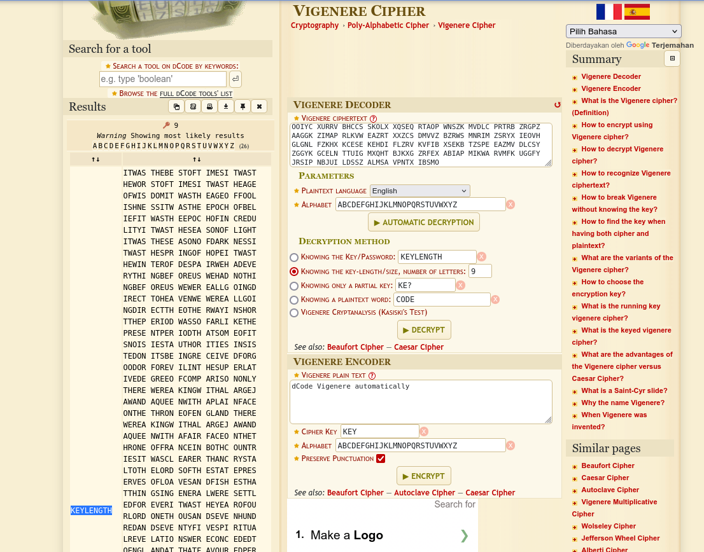
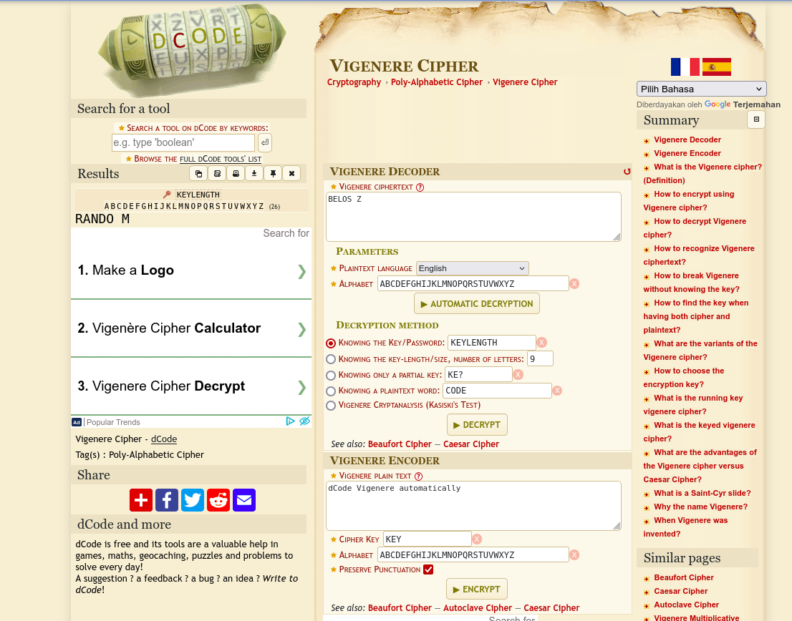



# soal
FA can break a known key length as well. Lets try one last polyalphabetic cipher, but this time the key length is unknown. Note: the text is writen in American English

Enjoy.

# ssh
```bash
sshpass -p "CLEARTEXT" ssh -o StrictHostKeyChecking=no krypton5@krypton.labs.overthewire.org -p 2231

# scp
sshpass -p "CLEARTEXT" scp -R -P 2231 krypton5@krypton.labs.overthewire.org:/krypton/krypton5/* krypton5
```

# solve
## Penyelesaian Menggunakan Tool Online
Gunakan situs [dcode.fr Vigenère Cipher](https://www.dcode.fr/vigenere-cipher) untuk mendekripsi teks dalam file found1. \

1. Masukkan cipher dari **found1** ke kolom **Cipher Text**.
2. Karena panjang kunci belum diketahui, coba **Knowing Key Length** dengan berbagai nilai. \
    
3. Ditemukan bahwa panjang kunci adalah **9**. \

4. Gunakan kunci yang ditemukan untuk mendekripsi **krypton5**, Pilih **Knowing the Key** dan masukkan **KEYLENGTH**, dan tekan **DECYRPT**. \
  

## solve with cli

# flag
RANDOM