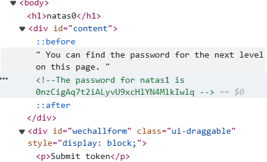

# soal
Natas teaches the basics of serverside web-security. \
Each level of natas consists of its own website located at http://natasX.natas.labs.overthewire.org, where X is the level number. There is no SSH login. To access a level, enter the username for that level (e.g. natas0 for level 0) and its password. \
Each level has access to the password of the next level. Your job is to somehow obtain that next password and level up. All passwords are also stored in /etc/natas_webpass/. E.g. the password for natas5 is stored in the file /etc/natas_webpass/natas5 and only readable by natas4 and natas5. \

Start here: \
Username: natas0 \
Password: natas0 \
URL:      http://natas0.natas.labs.overthewire.org \

# solve
- go http://natas0.natas.labs.overthewire.org
- use cred natas0:natas0
- inspect the website with dev tools
  
- or use view-source:<url>
- or use curl
```bash
curl http://natas0.natas.labs.overthewire.org -u natas0:natas0
# <html>
# <head></head>
# <body>
# <h1>natas0</h1>
# <div id="content">
# You can find the password for the next level on this page.
# 
# <!--The password for natas1 is 0nzCigAq7t2iALyvU9xcHlYN4MlkIwlq -->
# </div>
# </body>
# </html>
```

# flag
0nzCigAq7t2iALyvU9xcHlYN4MlkIwlq