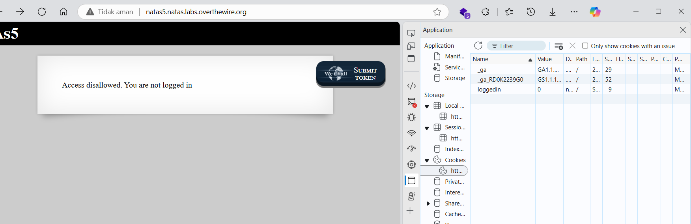
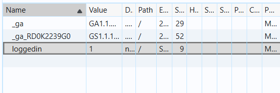
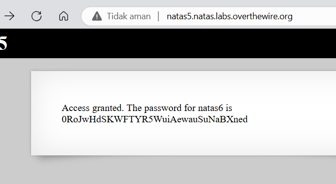



# soal
Username: natas5 \
URL:      http://natas5.natas.labs.overthewire.org

# solve
- use cred natas5:0n35PkggAPm2zbEpOU802c0x0Msn1ToK
- setelah saya lihat ternyata kita belum login jadi saya mencoba melihat di cookie apakah ada informasi login disini
  
- disini ternyata terdapat cookie untuk "loggedin": 0, kareana value 0 merupakan false
- jadi saya mengubah menjadi 1
  
- lalu saya merefresh halaman tersebut ctrl+r, dan berhasil mendapatkan flagnya
  
- atau gunakan curl 
  ```bash
  curl http://natas5.natas.labs.overthewire.org -u natas5:0n35PkggAPm2zbEpOU802c0x0Msn1ToK -b "loggedin=1"
  # Access granted. The password for natas6 is 0RoJwHdSKWFTYR5WuiAewauSuNaBXned</div>
  ```

# flag
0RoJwHdSKWFTYR5WuiAewauSuNaBXned