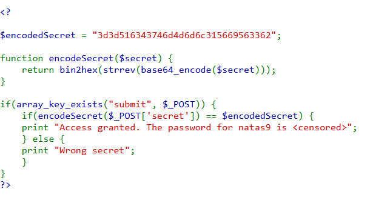
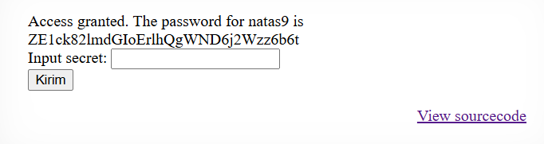



# soal
Username: natas8 \
URL:      http://natas8.natas.labs.overthewire.org

# solve
- use cred natas8:xcoXLmzMkoIP9D7hlgPlh9XD7OgLAe5Q
- disini ketika saya login terdapat sebuah input password seperti sebelumnya
- lalu saya mengecek soure codenya
  
  - terdapat encode source jadi sepertinya kita perlu melakuakn decode pada teks ini terlebih dahulu
  - dan karena function tersebut di input dengan hex saya mencoba dexode hex, lalu ada strrev, dan base64
- hex with python
    ```bash
    python2

    "3d3d516343746d4d6d6c315669563362".decode("hex")
    # '==QcCtmMml1ViV3b'
    ```
- disini bisa kita bisa lihat teksnya terbalik karena base64 itu == ada belakang bukan di depan
  - disini saya coba strrev menggunakan python
    ```python
    "==QcCtmMml1ViV3b"[::-1]
    # 'b3ViV1lmMmtCcQ=='
    ```
- lalu saya hanya perlu untuk decode menggunakan base64
  ```
  echo "b3ViV1lmMmtCcQ==" | base64 -d
  oubWYf2kBq
  ```
- dan menginput di websitenya dan akhirnya saya berhasil mendapatkan flagnya
  
  ```
  Access granted. The password for natas9 is ZE1ck82lmdGIoErlhQgWND6j2Wzz6b6t
  ```

# flag
ZE1ck82lmdGIoErlhQgWND6j2Wzz6b6t