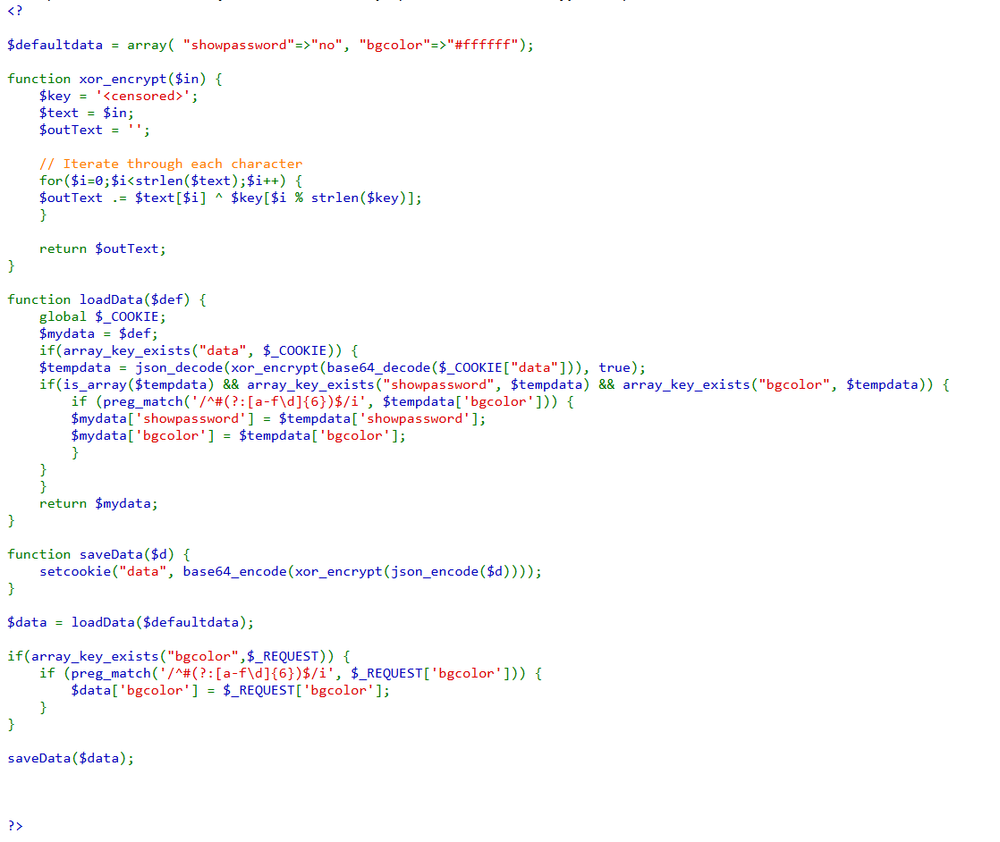
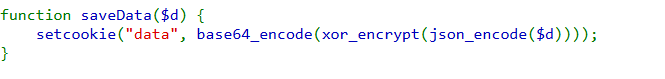
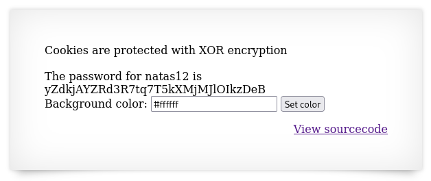

# soal
Username: natas11
URL:      http://natas11.natas.labs.overthewire.org

# solve
- use cred natas11:UJdqkK1pTu6VLt9UHWAgRZz6sVUZ3lEk
- ketika saya login saya melihat sebuah php yang dimana berisi set background color namun untuk datanya di simpan di cookie data
  
  - yang dimana ketika saya melihat lebih jelas lagi terdapat sebuah function save data, dan terdapat beberapa encode
    
- disini karena kita sudah tau bahwa data cookie akan di baca olehh python dan di decrypt dengan urutan
  - base64, xor, json
- maka saya akan mencoba mendecrypt untuk mendapatkan key nya terlebih dahulu
  - karena xor jika kita mengetahui 2 value pasti bisa mendapatkan key nya
    ```bash
    key?
    cipher = key ^ plain text
    key = plain text ^ cipher
    ```

## get_key
- keynya bisa ambill di data ya dan jangan lupa decode menggunakan url decode terlebih dahulu
  ```php
  <?php

  print json_encode(array("showpassword"=>"no", "bgcolor"=>"#ffffff"));
  print "\n";

  $cookie=base64_decode("HmYkBwozJw4WNyAAFyB1VUcqOE1JZjUIBis7ABdmbU1GIjEJAyIxTRg=");

  print $cookie;
  print "\n";

  function xor_encrypted($in) {
      $cipher = json_encode(array( "showpassword"=>"no", "bgcolor"=>"#ffffff"));
      $text = $in;
      $key = '';

      // Iterate through each character
      for($i=0;$i<strlen($text);$i++) {
      $key .= $text[$i] ^ $cipher[$i % strlen($cipher)];
      }

      return $key;
  }

  print xor_encrypted($cookie);
  print "\n";
  ?>
  ```
- run
  ```bash
  php get_key.php
  # 3'7  uUG*8MIf+;fmMF"1	"1M
  # eDWoeDWoeDWoeDWoeDWoeDWoeDWoeDWoeDWoeDWoe

  # bisa dilihat bahwa perulangan xor nya yaitu eDWo
  # jadi kita sudah mengetahui semua variablenya
  # key    = eDWo
  # cipher = eDWoeDWoeDWoeDWoeDWoeDWoeDWoeDWoeDWoeDWoe
  # plain  = {"showpassword":"no","bgcolor":"#ffffff"}
  ```

## encyrpt.php
- karena kita sudah tau key nya kita bisa melakukan encypt dengan key = eDWo
  ```php
  <?php
  $data = array( "showpassword"=>"yes", "bgcolor"=>"#ffffff");

  function xor_encrypt($in) {
      $key = 'eDWo';
      $text = $in;
      $outText = '';

      // Iterate through each character
      for($i=0;$i<strlen($text);$i++) {
      $outText .= $text[$i] ^ $key[$i % strlen($key)];
      }

      return $outText;
  }

  // print xor_encrypt($data);
  print base64_encode(xor_encrypt(json_encode($data)));
  print "\n";

  ?>
  ```
- run
  ```bash
  php encyrpt.php 
  HmYkBwozJw4WNyAAFyB1VUc9MhxHaHUNAic4Awo2dVVHZzEJAyIxCUc5
  ```
- dan ketika saya ubah cookienya pada webnya saya berhasil mendapatkan flagnya
  

- gunakan curl jika ingin mempercepat
  ```bash
  curl "http://natas11.natas.labs.overthewire.org/?bgcolor=%23ffffff" \
  -u natas11:UJdqkK1pTu6VLt9UHWAgRZz6sVUZ3lEk \
  --cookie "data=HmYkBwozJw4WNyAAFyB1VUc9MhxHaHUNAic4Awo2dVVHZzEJAyIxCUc5"

  # The password for natas12 is yZdkjAYZRd3R7tq7T5kXMjMJlOIkzDeB<br>
  ```

# flag
yZdkjAYZRd3R7tq7T5kXMjMJlOIkzDeB