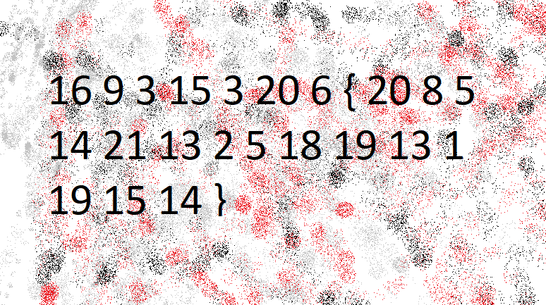

# soal
The numbers... what do they mean?

# hint
- The flag is in the format PICOCTF{}

# solve
```bash
wget https://jupiter.challenges.picoctf.org/static/f209a32253affb6f547a585649ba4fda/the_numbers.png

file the_numbers.png
# the_numbers.png: PNG image data, 774 x 433, 8-bit/color RGB, non-interlaced
```

- karena tidak ada informasi apapun di situ saya mencoba untuk mengecek gambar nya
  
  ```
  16 9 3 15 3 20 6 { 20 8 5 14 21 13 2 5 18 19 13 1 19 15 14 }
  ```
- jika dilihat lihat ini mirip format picoCTF{}
  - saya curiga ini merupakan angka yang sama dengan huruf semisal 1=a, 2=b
- lalu saya mencoba untuk melakukan convert secara manual
  ```
  picoCTF{THENUMBERSMASON}
  ```

# flag
picoCTF{THENUMBERSMASON}