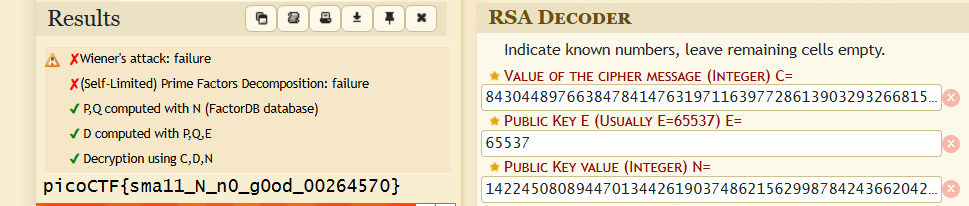

# soal
In RSA, a small e value can be problematic, but what about N? Can you decrypt this? values

# hint
- Bits are expensive, I used only a little bit over 100 to save money

# solve
```bash
wget https://mercury.picoctf.net/static/12d820e355a7775a2c9129b2622a7eb6/values

cat values
# Decrypt my super sick RSA:
# c: 843044897663847841476319711639772861390329326681532977209935413827620909782846667
# n: 1422450808944701344261903748621562998784243662042303391362692043823716783771691667
# e: 65537
```

- tool decrypt rsa
  - https://www.dcode.fr/rsa-cipher

- dan saya masukan seperti ini
  
  ```
  picoCTF{sma11_N_n0_g0od_00264570}
  ```

# flag
picoCTF{sma11_N_n0_g0od_00264570}