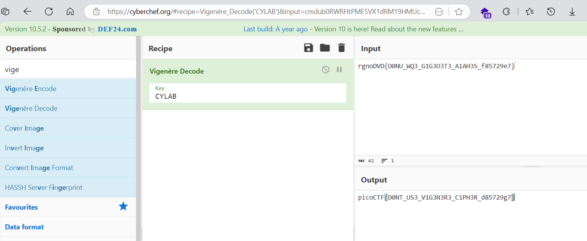

# soal
Can you decrypt this message? \
Decrypt this message using this key "CYLAB".

# hint
- https://en.wikipedia.org/wiki/Vigen%C3%A8re_cipher

# solve
```bash
wget https://artifacts.picoctf.net/c/159/cipher.txt

cat cipher.txt
# rgnoDVD{O0NU_WQ3_G1G3O3T3_A1AH3S_f85729e7}
```

## tool
- https://cyberchef.org/#recipe=Vigen%C3%A8re_Decode('CYLAB')&input=cmdub0RWRHtPME5VX1dRM19HMUczTzNUM19BMUFIM1NfZjg1NzI5ZTd9
  
  ```
  cipher = rgnoDVD{O0NU_WQ3_G1G3O3T3_A1AH3S_f85729e7}
  KEY = CYLAB
  # picoCTF{D0NT_US3_V1G3N3R3_C1PH3R_d85729g7}
  ```

# flag
picoCTF{D0NT_US3_V1G3N3R3_C1PH3R_d85729g7}