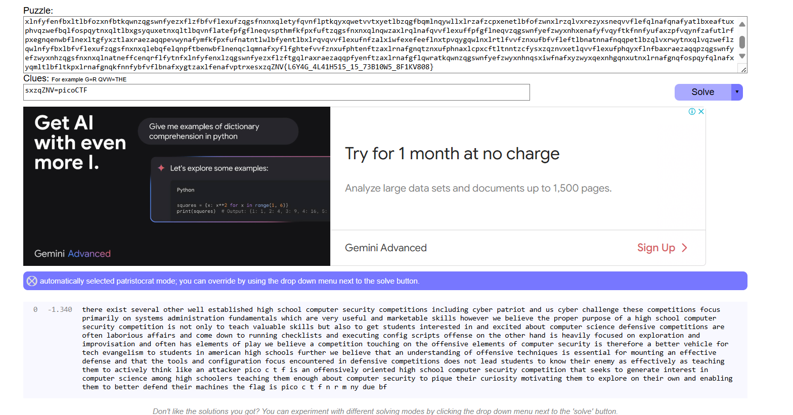

# soal
It seems that another encrypted message has been intercepted. \
The encryptor seems to have learned their lesson though and now there isn't any punctuation! Can you still crack the cipher? \
Download the message here.

# hint
- Try refining your frequency attack, maybe analyzing groups of letters would improve your results?

# solve
```bash
wget https://artifacts.picoctf.net/c/112/message.txt

cat message.txt
nafyffoxenefufytpqnafymfppfentkpxeafbaxraezaqqpzqgswnfyefzwyxnhzqgsfnxnxqlexlzpwbxlrzhkfystnyxqntlbwezhkfyzatppflrfnafefzqgsfnxnxqlevqzwesyxgtyxphqlehenfgetbgxlxenytnxqlvwlbtgflntpemaxzatyfufyhwefvwptlbgtycfntkpfecxppeaqmfufymfkfpxfufnafsyqsfyswysqefqvtaxraezaqqpzqgswnfyefzwyxnhzqgsfnxnxqlxelqnqlphnqnftzautpwtkpfecxppekwntpeqnqrfnenwbflnexlnfyfenfbxltlbfozxnfbtkqwnzqgswnfyezxflzfbfvflexufzqgsfnxnxqletyfqvnflptkqyxqwetvvtxyetlbzqgfbqmlnqywllxlrzafzcpxenetlbfofzwnxlrzqlvxrezyxsneqvvflefqlnafqnafyatlbxeaftuxphvqzwefbqlfospqytnxqltlbxgsyquxetnxqltlbqvnflatefpfgflneqvspthmfkfpxfuftzqgsfnxnxqlnqwzaxlrqlnafqvvflexuffpfgflneqvzqgswnfyefzwyxnhxenafyfvqyftkfnnfyufaxzpfvqynfzafutlrfpxegnqenwbflnexltgfyxztlaxraezaqqpevwynafymfkfpxfufnatntlwlbfyentlbxlrqvqvvflexufnfzalxiwfexefeeflnxtpvqygqwlnxlrtlfvvfznxufbfvfleftlbnatnnafnqqpetlbzqlvxrwytnxqlvqzweflzqwlnfyfbxlbfvflexufzqgsfnxnxqlebqfelqnpftbenwbflnenqclqmnafxyflfghtefvvfznxufphtenftzaxlrnafgnqtznxufphnaxlcpxcftltnntzcfysxzqznvxetlqvvflexufphqyxflnfbaxraezaqqpzqgswnfyefzwyxnhzqgsfnxnxqlnatneffcenqrflfytnfxlnfyfenxlzqgswnfyezxflzftgqlraxraezaqqpfyenftzaxlrnafgflqwratkqwnzqgswnfyefzwyxnhnqsxiwfnafxyzwyxqexnhgqnxutnxlrnafgnqfospqyfqlnafxyqmltlbfltkpxlrnafgnqkfnnfybfvflbnafxygtzaxlfenafvptrxesxzqZNV{L6Y4G_4L41H515_15_73B10W5_8F1KV808}
```

## tool
- https://www.quipqiup.com/
  -   
  - pola yang sudah saya dapat ini: ```sxzqZNV=picoCTF```
- kareana dibawah sudah dapat pola yang benar hanya saja karena ada nomer tidak kena jadi saya mencoba memindahkan teks hasil frequency ini ke dalam flag
  ```
  pico c t f n r m ny due bf
  sxzqZNV{L6Y4G_4L41H515_15_73B10W5_8F1KV808}

  picoCTF{N6R4M_4L41H515_15_73B10W5_8F1KV808}
  picoCTF{N6R4M_4N41Y515_15_73B10W5_8F1KV808}
  picoCTF{N6R4M_4N41Y515_15_73D10U5_8E1BF808}
  ```

## manual
```bash
git clone https://github.com/m-rosinsky/Krypton_Scripts
cp Krypton_Scripts/freq_analysis.py .

# ...
```

# flag
picoCTF{N6R4M_4N41Y515_15_73D10U5_8E1BF808}