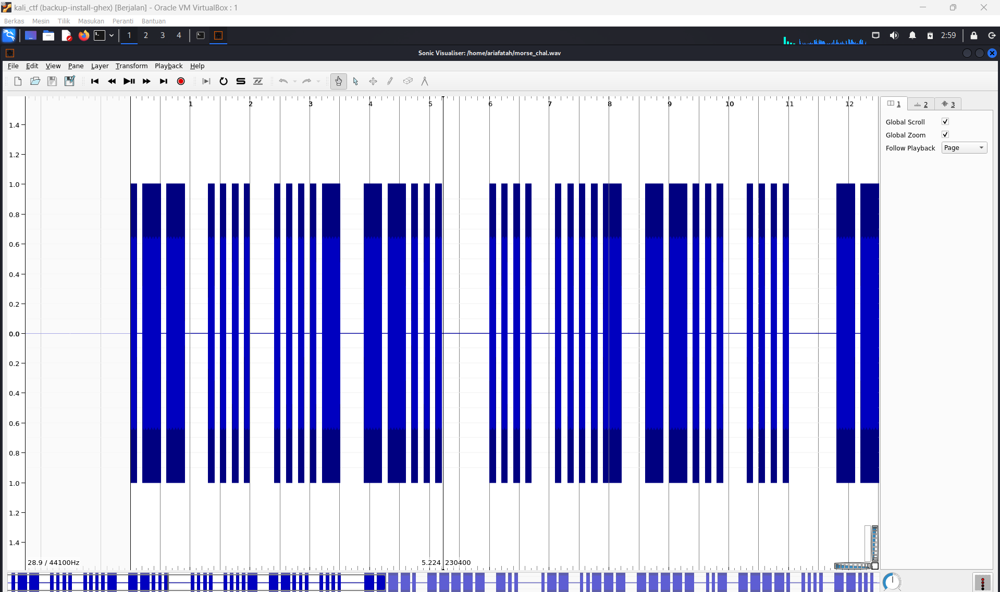

# soal
Morse code is well known. Can you decrypt this? \
Download the file here. \
Wrap your answer with picoCTF{}, put underscores in place of pauses, and use all lowercase.

# hint
- Audacity is a really good program to analyze morse code audio.

# solve
- saya me wget wav tersebut dan ketika saya coba run musicnya ternyata terdapat sebuah sandi morse jadi saya mulai menulisnya
  
  ```
  
  ```


# flag