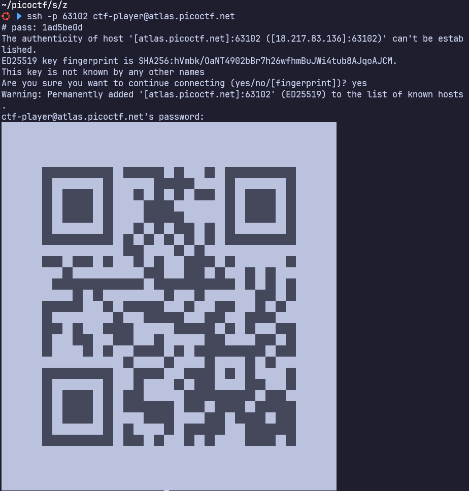
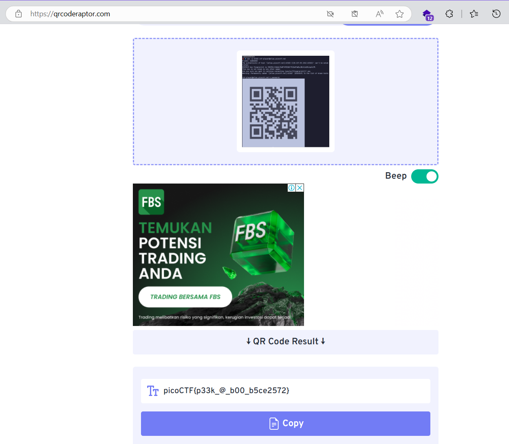

# soal
I've gotten bored of handing out flags as text. Wouldn't it be cool if they were an image instead? \
You can download the challenge files here: \
challenge.zip

## launch istance
The same files are accessible via SSH here: \
ssh -p 63102 ctf-player@atlas.picoctf.net \
Using the password 1ad5be0d. Accept the fingerprint with yes, and ls once connected to begin. Remember, in a shell, passwords are hidden!

# hint
- QR codes are a way of encoding data. While they're most known for storing URLs, they can store other things too.
- Mobile phones have included native QR code scanners in their cameras since version 8 (Oreo) and iOS 11
- If you don't have access to a phone, you can also use zbar-tools to convert an image to text

# solve
```bash
wget https://artifacts.picoctf.net/c_atlas/2/challenge.zip

ssh -p 63102 ctf-player@atlas.picoctf.net
# pass: 1ad5be0d
```

- ketika login ternyata terdapat sebuah code qr
  
- https://qrcoderaptor.com/
  - 
    ```picoCTF{p33k_@_b00_b5ce2572}```

# flag
picoCTF{p33k_@_b00_b5ce2572}