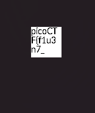
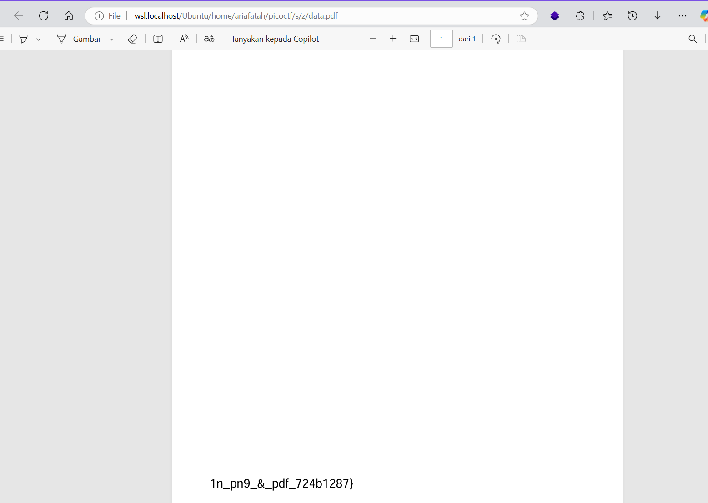

# soal
The Network Operations Center (NOC) of your local institution picked up a suspicious file, they're getting conflicting information on what type of file it is. \
They've brought you in as an external expert to examine the file. \
Can you extract all the information from this strange file? \
Download the suspicious file here.

# hint
- This problem can be solved by just opening the file in different ways

# solve
```bash
wget https://artifacts.picoctf.net/c_titan/97/flag2of2-final.pdf

file flag2of2-final.pdf
# flag2of2-final.pdf: PNG image data, 50 x 50, 8-bit/color RGBA, non-interlaced

binwalk flag2of2-final.pdf
# DECIMAL       HEXADECIMAL     DESCRIPTION
# --------------------------------------------------------------------------------
# 0             0x0             PNG image, 50 x 50, 8-bit/color RGBA, non-interlaced
# 914           0x392           PDF document, version: "1.4"
# 1149          0x47D           Zlib compressed data, default compression
```

- with foremost
  ```bash
  foremost flag2of2-final.pdf
  ls output/
  # audit.txt  png

  ## ketika saya cek png nya ternyata terdapat flag
  # picoCTF{f1u3n7_
  ```

- with dd
  ```bash
  dd bs=1 skip=1149 if=flag2of2-final.pdf of=data.zlib
  dd bs=1 skip=914 if=flag2of2-final.pdf of=data.pdf

  ## ketika saya coba pdf terdapat flag
  # 1n_pn9_&_pdf_724b1287}
  ```

- with binwalk   
  ```bash
  binwalk -e flag2of2-final.pdf

  cd _flag2of2-final.pdf.extracted/
  cat 47D
  # (1n_pn9_&_pdf_724b1287})Tj
  ```

- png
  
- pdf
  

# flag
picoCTF{f1u3n7_1n_pn9_&_pdf_724b1287}