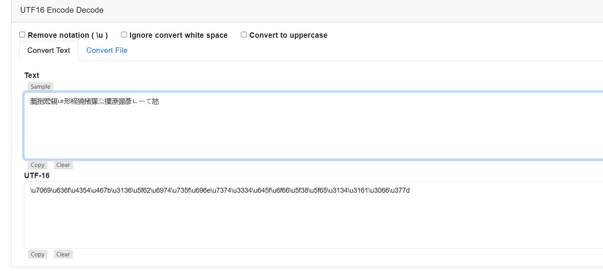

# soal
I wonder what this really is... enc ''.join([chr((ord(flag[i]) << 8) + ord(flag[i + 1])) for i in range(0, len(flag), 2)])

# hint
- You may find some decoders online

# solve
```bash
wget https://mercury.picoctf.net/static/e47483f88b12f2ab0c46315afc12f64d/enc

cat enc
# 灩捯䍔䙻ㄶ形楴獟楮獴㌴摟潦弸彥ㄴㅡて㝽 
```

## with tool web
- disini kita bisa lihat bahwa teks enc tersebut seperti menggunakan UTF-16 (big-endian)
- disini saya akan mencoba dengan tool utf-16 to hex
  - https://www.coderstool.com/utf16-encoding-decoding
    
    ```
    \u7069\u636f\u4354\u467b\u3136\u5f62\u6974\u735f\u696e\u7374\u3334\u645f\u6f66\u5f38\u5f65\u3134\u3161\u3066\u377d
    ```
- lalu convert ke ascii menggunakan tool hex to ascii
  - https://www.rapidtables.com/convert/number/hex-to-ascii.html
    ```
    picoCTF{16_bits_inst34d_of_8_e141a0f7}
    ```

## with python3
```python
ipython3

enc = open("enc").read()
print enc
# 灩捯䍔䙻ㄶ形楴獟楮獴㌴摟潦弸彥ㄴㅡて㝽

for i in enc:
    print(hex(ord(i)))
# 0xe7
# 0x81
# ...

for i in enc:
    print(hex(ord(i)).lstrip("0x"))
# 7069
# 636f
# 4354

for i in enc:
    print(hex(ord(i)).lstrip("0x"),end="")
# 7069636f4354467b31365f626974735f696e73743334645f6f665f385f65313431613066377d

import codecs
codecs.decode('7069636f4354467b31365f626974735f696e73743334645f6f665f385f65313431613066377d', 'hex')
# b'picoCTF{16_bits_inst34d_of_8_e141a0f7}'
```

# flag
picoCTF{16_bits_inst34d_of_8_e141a0f7}