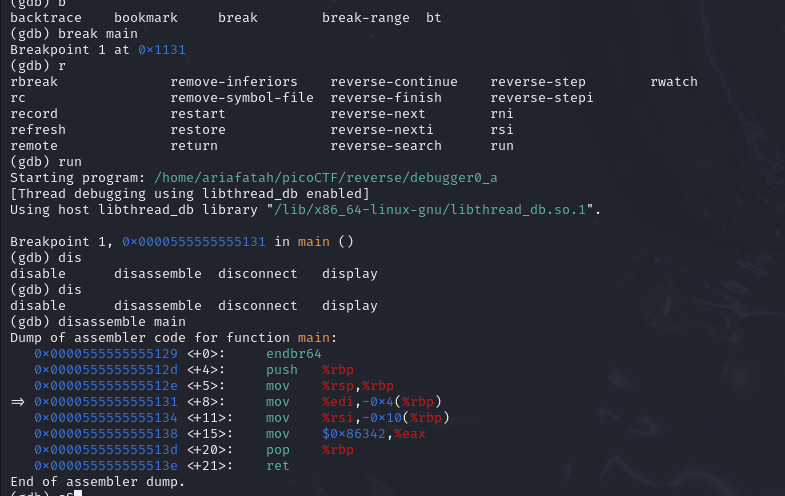

# soal
Can you figure out what is in the eax register at the end of the main function? \
Put your answer in the picoCTF flag format: picoCTF{n} where n is the contents of the eax register in the decimal number base. \
If the answer was 0x11 your flag would be picoCTF{17}. \
Disassemble this.

# hint
- di soal kita perlu mencari register eax dan semisal jika nilai adalah 0x11 maka hasilnya adalah 17 => picoCTF{17}

# solve

```bash
wget https://artifacts.picoctf.net/c/512/debugger0_a
chmod +x debugger0_a

gdb ./debugger0_a

break main

disassemble main
# Dump of assembler code for function main:
#    0x0000000000001129 <+0>:     endbr64
#    0x000000000000112d <+4>:     push   %rbp
#    0x000000000000112e <+5>:     mov    %rsp,%rbp
#    0x0000000000001131 <+8>:     mov    %edi,-0x4(%rbp)
#    0x0000000000001134 <+11>:    mov    %rsi,-0x10(%rbp)
#    0x0000000000001138 <+15>:    mov    $0x86342,%eax
#    0x000000000000113d <+20>:    pop    %rbp
#    0x000000000000113e <+21>:    ret
# End of assembler dump.

## cari eax
# 0x0000000000001138 <+15>:    mov    $0x86342,%eax

## ubah hex menjadi angka
python3
0x86342
# 549698

## dan gabungkan dengan format picoCTF{}
picoCTF{549698}
```

# flag
picoCTF{549698}