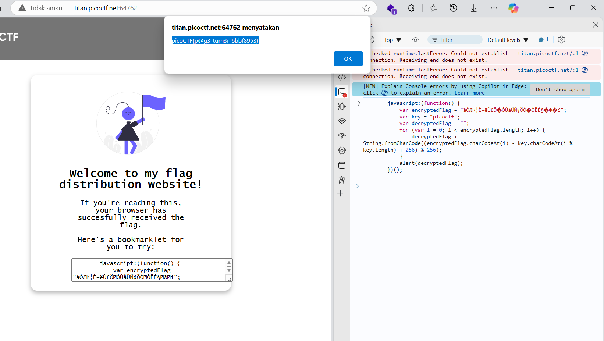

# soal
Why search for the flag when I can make a bookmarklet to print it for me? \
Additional details will be available after launching your challenge instance.

## launch istance
Why search for the flag when I can make a bookmarklet to print it for me? \
Browse here, and find the flag!

# hint
- A bookmarklet is a bookmark that runs JavaScript instead of loading a webpage.
- What happens when you click a bookmarklet?
- Web browsers have other ways to run JavaScript too.

# solve
- disini di webnya terdapatt sebuah teks code javascript
- jadi saya mencoba run di console web
  
  ```
  picoCTF{p@g3_turn3r_6bbf8953}
  ```

# flag
picoCTF{p@g3_turn3r_6bbf8953}