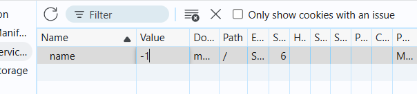
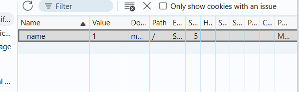
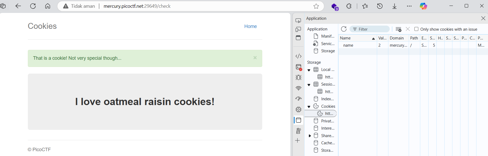
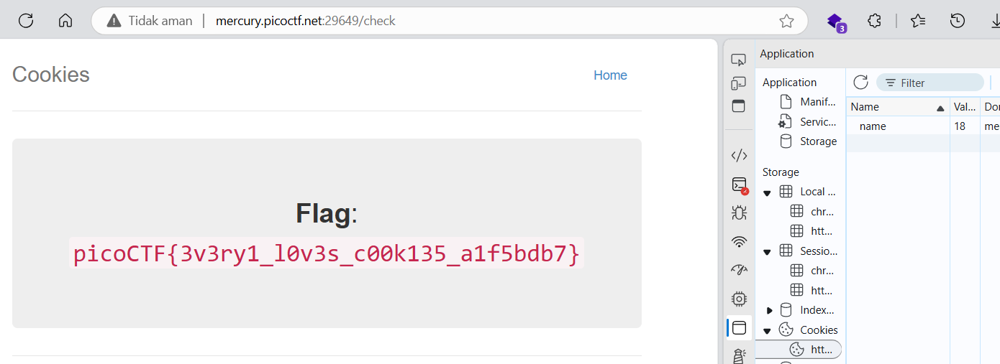

# soal
Who doesn't love cookies? Try to figure out the best one. http://mercury.picoctf.net:29649/

# solve
- saya mencoba inspect dan mengecek cookie nya
- disini di cookie terdapat sebuah key name: -1", dan saya mencoba mengubahnya menjadi "name: 1"
  
  
- dan saya refresh ternyata berhasil jadi saya mengubah format nya menjadi picoCTF{}
  - namun ketika saya ingin me submit flagnya itu tidak berhasil
- jadi saya mencoba ubah value menjadi 2 dan ternyata outputnya berubah
  
- saya langsung mencoba merubah cookie nya 1 persatu dan saya menemukan di value ke 18
  

# flag
picoCTF{3v3ry1_l0v3s_c00k135_a1f5bdb7}