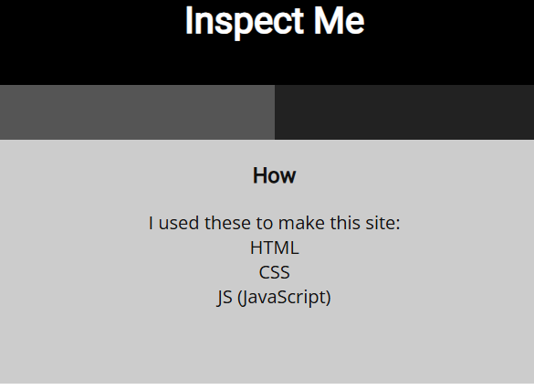

# soal
Kishor Balan tipped us off that the following code may need inspection: https://jupiter.challenges.picoctf.org/problem/9670/ (link) or http://jupiter.challenges.picoctf.org:9670

# hint
- How do you inspect web code on a browser?
- There's 3 parts

# solve
- disini jika kita lihat dia membuat web ini dengan html, css, js
  
- mungkin saja flagnya terdapat di 3 file itu
  - view-source:https://jupiter.challenges.picoctf.org/problem/9670/index.html
    ```<!-- Html is neat. Anyways have 1/3 of the flag: picoCTF{tru3_d3 -->```
  - https://jupiter.challenges.picoctf.org/problem/9670/mycss.css
    ```/* You need CSS to make pretty pages. Here's part 2/3 of the flag: t3ct1ve_0r_ju5t */```
  - https://jupiter.challenges.picoctf.org/problem/9670/myjs.js
    ```/* Javascript sure is neat. Anyways part 3/3 of the flag: _lucky?2e7b23e3} */```
- lalu gabungkan flagnya sesuai urutan
  ```picoCTF{tru3_d3t3ct1ve_0r_ju5t_lucky?2e7b23e3}```

# flag
picoCTF{tru3_d3t3ct1ve_0r_ju5t_lucky?2e7b23e3}