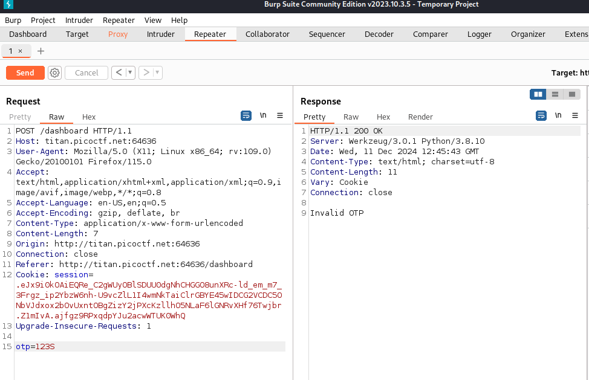
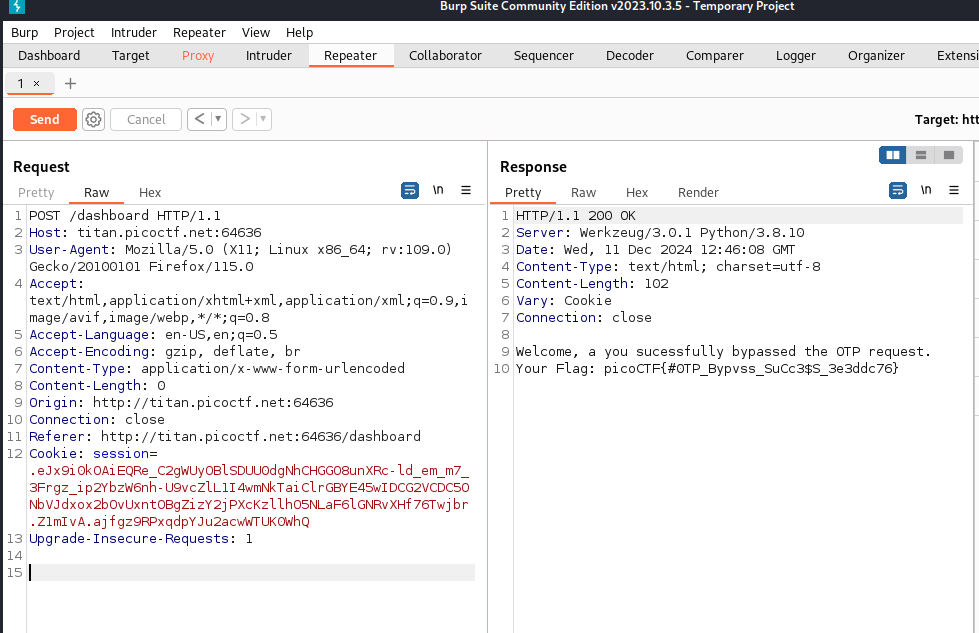

# soal
Additional details will be available after launching your challenge instance.

## launch istance
Try here to find the flag

# hint
- Try using burpsuite to intercept request to capture the flag.
- Try mangling the request, maybe their server-side code doesn't handle malformed requests very well.

# solve
- terdapat sebuah form register dan ketika saya register terdapat sebuah otp code untuk verify
- hanya saja kita tidak tahu kode otpnya
  - dan saya mencoba menggunakan burp suite dan ketika melakuakn mesumbmit ke otp aku menghapus baris itu dan ya aku berhasil mendapatkan flag
    
    
- dan ini adalah outputnya
  ```
  Welcome, a you sucessfully bypassed the OTP request. 
  Your Flag: picoCTF{#0TP_Bypvss_SuCc3$S_3e3ddc76}
  ```

# flag
picoCTF{#0TP_Bypvss_SuCc3$S_3e3ddc76}