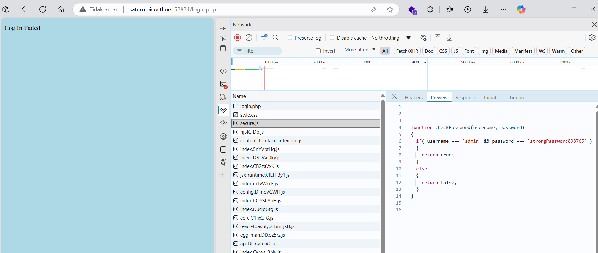

# soal
Can you get the flag? \
Additional details will be available after launching your challenge instance.

## launch istance
Can you get the flag? \
Go to this website and see what you can discover.

# hint
- How is the password checked on this website?

# solve
- disini ketika saya coba login tidak berhasil hasil
- namun ketika saya mencoba untuk check network terdapat sebuah secure.js yang berisi function checkpassword
  
  - http://saturn.picoctf.net:52824/secure.js
    ```if( username === 'admin' && password === 'strongPassword098765' )```
  - hanya saja user dan passwordnya tidak di encrypt jadi saya langsung mencoba untuk login
- dan saya mendapatkan flagnya
  ```
  picoCTF{j5_15_7r4n5p4r3n7_b0c2c9cb}
  ```

# flag
picoCTF{j5_15_7r4n5p4r3n7_b0c2c9cb}