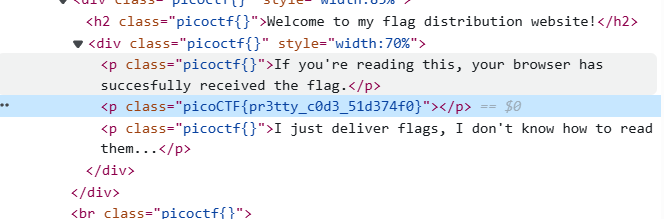

# soal
I don't like scrolling down to read the code of my website, so I've squished it. As a bonus, my pages load faster! \
Additional details will be available after launching your challenge instance.

## launch istance
I don't like scrolling down to read the code of my website, so I've squished it. As a bonus, my pages load faster! \
Browse here, and find the flag!


# hint
- Try CTRL+U / ⌘+U in your browser to view the page source. You can also add 'view-source:' before the URL, or try curl <URL> in your shell.
- Minification reduces the size of code, but does not change its functionality.
- What tools do developers use when working on a website? Many text editors and browsers include formatting.

# solve
- ketika aku inspect dan melihat lihat aku menemukan flagnya
  
  ```
  <p class="picoCTF{pr3tty_c0d3_51d374f0}"></p>
  ```

# flag
picoCTF{pr3tty_c0d3_51d374f0}