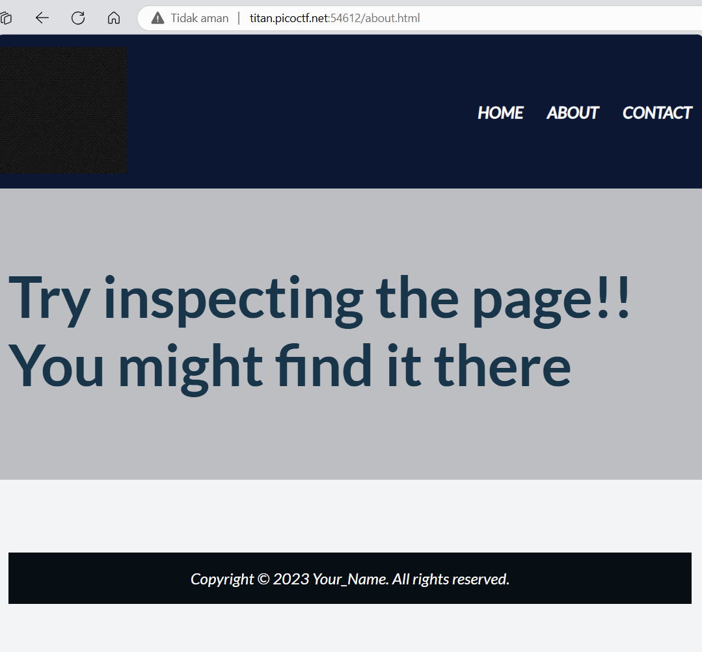
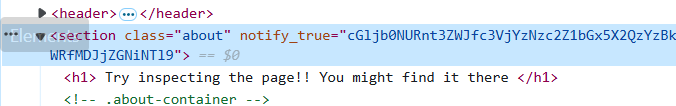

# soal
Do you know how to use the web inspector? \
Additional details will be available after launching your challenge instance.

## launch istance
Do you know how to use the web inspector? \
Start searching here to find the flag

# hint
- Use the web inspector on other files included by the web page.
- The flag may or may not be encoded

# solve
- saya mencoba berpindah halaman dan menginspect salah satu page yaitu about
  
- dan ketika saya inspect saya menemukan kode yang mungkin saja berisi flag
  
- lalu saya mencoba untuk mendecode dengan base64
  ```bash
  echo "cGljb0NURnt3ZWJfc3VjYzNzc2Z1bGx5X2QzYzBkZWRfMDJjZGNiNTl9" | base64 -d
  # picoCTF{web_succ3ssfully_d3c0ded_02cdcb59}
  ```

# flag
picoCTF{web_succ3ssfully_d3c0ded_02cdcb59}