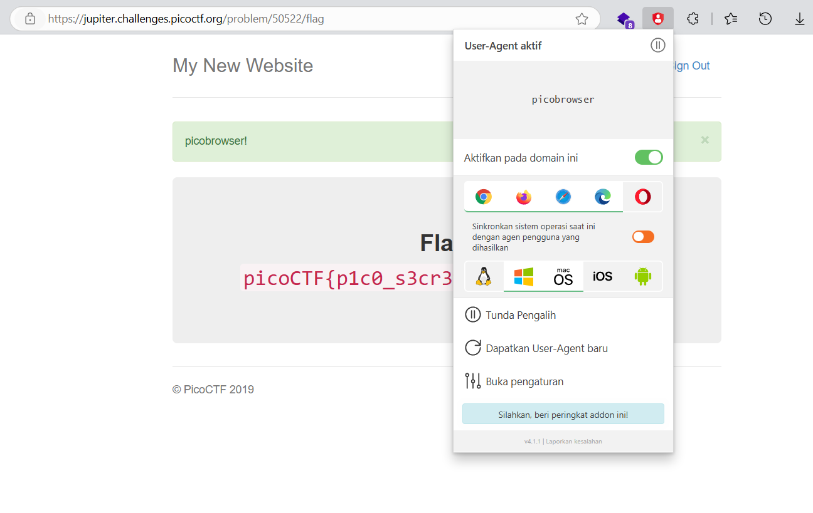

# soal
This website can be rendered only by picobrowser, \
go and catch the flag! https://jupiter.challenges.picoctf.org/problem/50522/ (link) \
or http://jupiter.challenges.picoctf.org:50522

# hint
- You don't need to download a new web browser

# solve
- ketika saya cobaa get flag tidak berhasil dan tulisanya ur not picobrowser
- jadi saya mencoba mengganti user agent punya saya dengan extension
   
- atau gunakan curl
  ```bash
  curl https://jupiter.challenges.picoctf.org/problem/50522/flag -H "User-Agent: picobrowser" | grep pico

  # <div class="jumbotron">
  #     <p class="lead"></p>
  #     <p style="text-align:center; font-size:30px;"><b>Flag</b>: <code>picoCTF{p1c0_s3cr3t_ag3nt_51414fa7}</code></p>
  #     <!-- <p><a class="btn btn-lg btn-success" href="admin" role="button">Click here for the flag!</a> -->
  #     <!-- </p> -->
  # </div>
  ```

# flag
picoCTF{p1c0_s3cr3t_ag3nt_51414fa7}