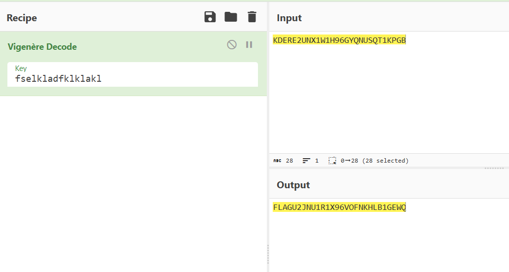
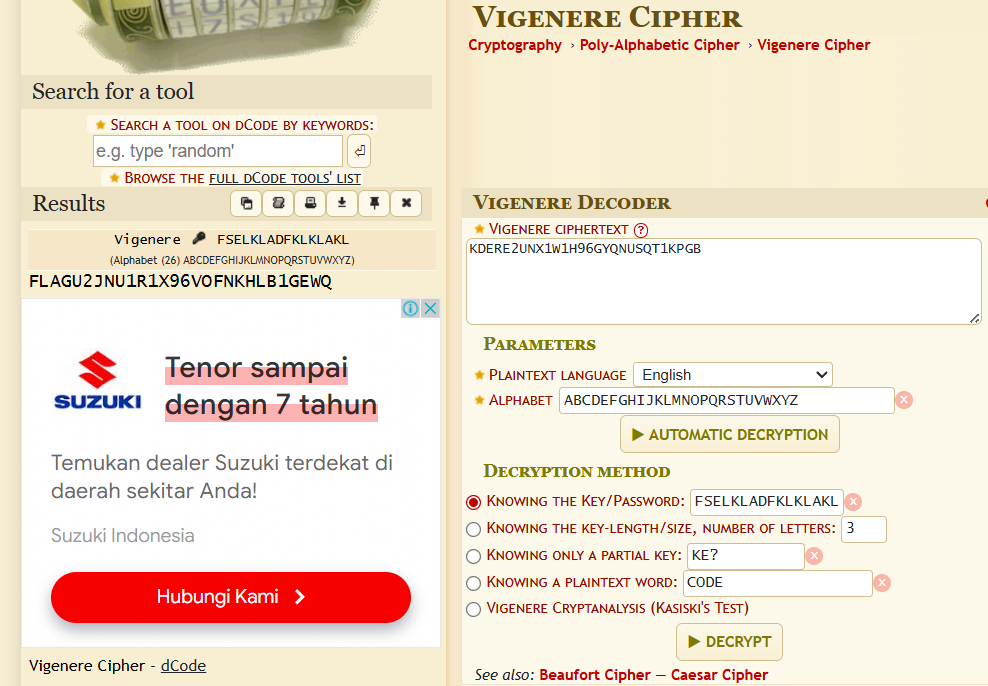

# soal
I think that's the key "fselkladfklklakl" \
KDERE2UNX1W1H96GYQNUSQT1KPGB

# solve
- kurasa ini adalah cipher jenis xor atau vigenere karena menggunakan key
  - https://cyberchef.org/#recipe=Vigen%C3%A8re_Decode('fselkladfklklakl')&input=S0RFUkUyVU5YMVcxSDk2R1lRTlVTUVQxS1BHQg
    
    ```
    FLAGU2JNU1R1X96VOFNKHLB1GEWQ
    ```
  - https://www.dcode.fr/vigenere-cipher
    

# flag
FLAGU2JNU1R1X96VOFNKHLB1GEWQ