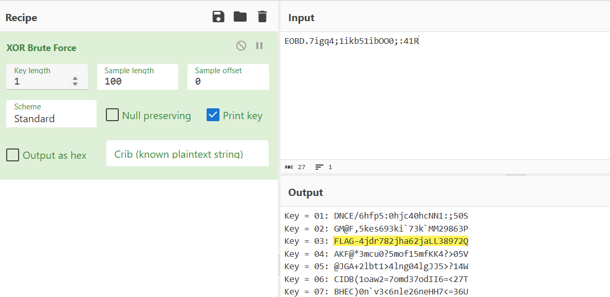

# soal
RU9CRC43aWdxNDsxaWtiNTFpYk9PMDs6NDFS

# solve
## tool
- pertama tama saya mencoba melakukan decode menggunakan base64 terlebih dahulu
  ```EOBD.7igq4;1ikb51ibOO0;:41R```
- karena angkanya acak saya mencurigai ini adalah xor
  - https://cyberchef.org/#recipe=XOR_Brute_Force(1,100,0,'Standard',false,true,false,'')&input=RU9CRC43aWdxNDsxaWtiNTFpYk9PMDs6NDFS
    
    ```
    Key = 03
    FLAG-4jdr782jha62jaLL38972Q
    ``` 

## manual
- pertama tama saya mencoba mendecode dengan base64
  ```bash
  echo "RU9CRC43aWdxNDsxaWtiNTFpYk9PMDs6NDFS" | base64 -d
  # EOBD.7igq4;1ikb51ibOO0;:41R
  ```
- lalu saya mencoba melakukan brute xor decrypt dengan python
  ```bash
  cat enc
  # EOBD.7igq4;1ikb51ibOO0;:41R

  ipython2
  enc = open("enc").read()
  def xor_string(string, key):
    result = ""
    for c in string:
        result += chr(ord(c) ^ key)
    return result

  for i in range(0, 256):
    print i, xor_string(enc, i)

  ### atau 1 perintah ini untuk
  ## untuk python2
  print "\n".join("{}: {}".format(i, "".join(chr(ord(c) ^ i) for c in open('enc').read())) for i in xrange(256))

  ## python3
  print("\n".join(f"{i}: {''.join(chr(ord(c) ^ i) for c in open('enc').read())}" for i in range(256)))
  # 3: FLAG-4jdr782jha62jaLL38972Q
  ```

# flag
FLAG-4jdr782jha62jaLL38972Q